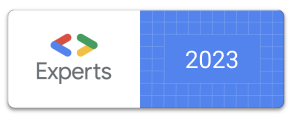

Hi! 👋 This is Jorge. Welcome to The Ultimate Android Course, where you will learn everything you need to become a professional Android developer.

I've coded Android apps for many years and also have deep experience as a trainer. As a <a href="https://developers.google.com/community/experts/directory/profile/profile-jorge_castillo">Google Developer Expert for Android & Kotlin</a>, I can offer you correctness, conciseness and quality to yield productive results 🚀

---

## The structure

This course is actually split in **3 different courses** organized by level. The goal is to target a more accurate audience for each, and so we can complete them in order.

### Basic Android FREE 🎁

Teaches us to code complete Android applications. Includes everything we need to **start working professionally** 👨‍💻

### Intermediate Android 49.99 💵

This course is built on top of the basic one, and expands on topics like coroutines in depth, advanced networking and persistence, design patterns, architecture, testing, custom views, themes, advanced layouts (ConstraintLayout), reactive programming and more. **Become an experienced Android dev** with this course 🤩

### Advanced Android 49.99 💵

Jetpack Compose, Continuous Integration, screenshot testing, property based testing, low level rendering (Canvas) and animations (transitions), implementing design systems, MotionLayout, Gradle caches, Kotlin buildscript and much more. Take this course to **become an expert** in Android development 🚀

---

Paid courses can be acquired separately. Take this as a chance of supporting me so I can keep motivation up 🙌 and keep content up to date 🙏

You can **acquire all of them together with a single payment** with the following offer:

COMPLETE COURSE 🚀 SINGLE PAYMENT - 80﹩ 🤩

---

## The Courses

During these courses we will build a series of apps together by a list of easily consumable learning pills. They are focused on learning by example. Let's go straight into content.

### Basic Android FREE 🎁

Take this course to learn how to write complete Android apps. Includes everything we need to become a **professional Android developer** 👨‍💻👇

**Our first project**

* 💊 [Pill 1]({{ baseurl }}/androidcourse/pill1/) – Download and install Android Studio
* 💊 [Pill 2]({{ baseurl }}/androidcourse/pill2/) – Creating a new project
* 💊 [Pill 3]({{ baseurl }}/androidcourse/pill3/) – Minimum Android SDK
* 💊 [Pill 4]({{ baseurl }}/androidcourse/pill4/) – Project structure Overview
* 💊 [Pill 5]({{ baseurl }}/androidcourse/pill5/) – settings.gradle
* 💊 [Pill 6]({{ baseurl }}/androidcourse/pill6/) – build.gradle
* 💊 [Pill 7]({{ baseurl }}/androidcourse/pill7/) – Application build.gradle
* 💊 [Pill 8]({{ baseurl }}/androidcourse/pill8/) – Android configuration
* 💊 [Pill 9]({{ baseurl }}/androidcourse/pill9/) – Application dependencies

**Our first screen**

* 💊 [Pill 10]({{ baseurl }}/androidcourse/pill10/) – Adding a screen to our app
* 💊 [Pill 11]({{ baseurl }}/androidcourse/pill11/) – Creating our first layout
* 💊 [Pill 12]({{ baseurl }}/androidcourse/pill12/) – Running our app
* 💊 [Pill 13]({{ baseurl }}/androidcourse/pill13/) – Adding the Activity to the AndroidManifest

**Adding logic to our screen**

* 👷‍♂️ Under construction

**Entering navigation**

* 👷‍♂️ Under construction

**Entering navigation**

* 👷‍♂️ Under construction

---

Or **acquire all of them together with a single payment** with the following offer:

COMPLETE COURSE 🚀 SINGLE PAYMENT - 80﹩ 🤩

---

**Contact**

You can find me [on Twitter](https://www.twitter.com/JorgeCastilloPR), where I share all my experiences as a developer, and also [on Instagram](https://www.instagram.com/jorgecastillopr).

Please feel free to contact by any of the mentioned networks or [by mail](mailto:jorge.castillo.prz@gmail.com).
