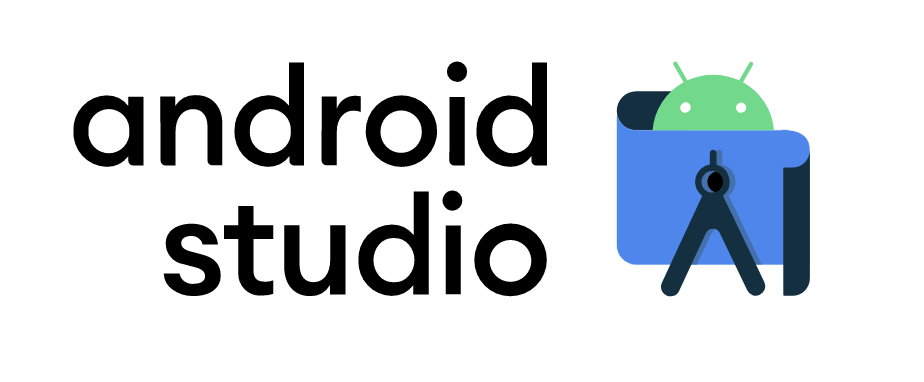

Before starting to build our first Android app we need to get our environment ready. There are two main [IDEs](https://en.wikipedia.org/wiki/Integrated_development_environment) you can use to develop Android apps:

* **IntellIJ**: Generic IDE with support for multiple languages and platforms. Like an all-in-one version that sometimes might be an overkill.
* **Android Studio**: Based on IntellIJ, focused on Android. Provides specific tools designed to leverage Android development.

We are picking the later for this course, since it's the "de-facto standard" to build Android apps ✅

Let's go ahead and download the latest Android Studio stable <a target="_blank" href="https://developer.android.com/studio">from here</a>. Then we can proceed to install it.

If you are in MacOS you might need to confirm once you want to run it for the first time.

Once we open it, we'll see a menu with options to create a new project from scratch or open an existing one, get a project from version control (which we are omitting for now), import a project from different formats, or import an official Android code sample.

> Note that menus might vary a bit compared to the images here, depending on which is the latest stable version at the moment of consuming this course.

This means we are ready to create our first Android project 👏👏

[Next: Creating a new project >]({{ baseurl }}/androidcourse/pill2/)

### Contact me for doubts!

You can find me [on Twitter](https://www.twitter.com/JorgeCastilloPR), where I share all my experiences as a developer, and also [on Instagram](https://www.instagram.com/jorgecastillopr).

Please feel free to contact by any of the mentioned networks or [by mail](mailto:jorge.castillo.prz@gmail.com).
