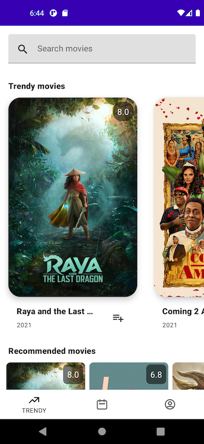

There are different UI components that can represent a screen in an Android app. The most basic one is the **Activity**.

Any Android apps contain at least one Activity. Many of them have a single one and then implement some sort of navigation between different tabs inside. This is actually what Google recommends. But we'll get to that at the right time.



> Activity is what you normally see on screen whenever you launch an app in your phone. A fullscreen UI container.

To add our first screen we must go to `app/src/main/java/` but why java and not kotlin? Because the `java` directory is **automatically created and marked as code sources by Android Studio**. Don't worry, we can add Kotlin files in there without any problem.

We could also configure an equivalent `kotlin` directory but that would require some extra Gradle configuration.

### We'll need a package first

The main mechanism to organize files within a module are the **packages**. You can think of them as folders containing code files. If you created the project using the Anroid Studio wizard you'll likely have a package already with the name you picked when creating the project. For me it is `dev.jorgecastillo.adoptme`.

In case you don't have a package, you can create it inside `app/src/main/java/` by doing `right click over java` -> `New` -> `package`, then write your package name.

> Remember that using a reverse domain name followed by the application name is a good practice.

### Adding the Activity

We have two options here. We can use the Android Studio wizard to create it for us or do it manually. If let Android Studio do it , it will create all the required files for us after filling some simple fields in a form.

To do it we could `right click over the package` -> `New` -> `Activity` -> `Basic Activity` and we'd see the wizard like:


But I rather doing it manually, since we are here to learn and that will give us a view of all the components required.

So let's do `right click over the package` -> `New` -> `Kotlin Class/File` -> then create a class named `LoginActivity` 👍

That will create the file for you with a class. First thing we want to do is extending `AppCompatActivity`, which is a base class to provide support for basic theming and fragments. We'll get into fragments soon but think of them as subsections in our UI that we can easily add and replace. (Useful for tabs!)

```kotlin
class LoginActivity : AppCompatActivity() {
}
```

This will not do much, we still need to add some UI to our screen. For activities you do that within the `onCreate` method, which we can override from the parent activity. This is the variant we want to override 👇

```kotlin
class LoginActivity : AppCompatActivity() {
    override fun onCreate(savedInstanceState: Bundle?) {
        super.onCreate(savedInstanceState) // Don't forget calling super!
        setContentView(R.layout.activity_main)
    }
}
```

`onCreate` is part of the Android **"lifecycle"** of an Activity. Activities have a lifecycle with a few steps that the Android system calls in order. One of the initial steps is `onCreate`, that is called when the Activity is getting created. That's where the UI gets linked to the activity, which stands more like a logic holder for the wiring.

It is very important to not forget calling super.onCreate, given that the parent class needs to initialize a few things from the `appcompat` library for properly supporting compatibility UI widgets, themes and other compatibility APIs among other things.

Then there is the `setContentView(R.layout.activity_main)` call. That is where we bind our screen (Activity) to the UI, which is represented with a **layout**.

We'll see `activity_main` colored in red since we're still missing that file. We will learn how to create it (our first layout) in the next pill! 👍

---

[Next: Creating our first layout >]({{ baseurl }}/androidcourse/pill11/)

### Contact me for doubts!

You can find me [on Twitter](https://www.twitter.com/JorgeCastilloPR), where I share all my experiences as a developer, and also [on Instagram](https://www.instagram.com/jorgecastillopr).


Please feel free to contact by any of the mentioned networks or [by mail](mailto:jorge.castillo.prz@gmail.com).
