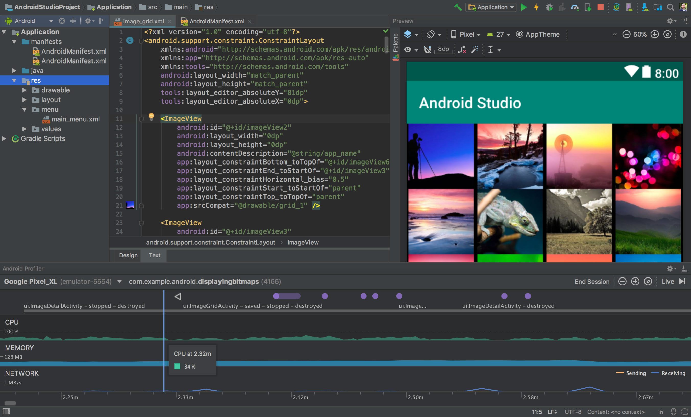

### A small disclaimer 🚨

If we look again to the image above, we'll notice that the wizard already gives us some info about the percentage of devices that will support our app depending on the Minimum SDK we choose 🧐

The minimum allowed here is Android 4.1, which is **super old (July 2012)**. If we picked that one, we'd support a 99.8% of the devices out there, so it would seem like a great pick at a first glance.

Problem is Android APIs have evolved a lot over the years, and by picking a too old min SDK, we would require lots of conditional logics in our code to make it both retrocompatible and still support the nicer features only available on newer versions of the SDK. This can become quite counterproductive 😔

I highly recommend **finding a good compromise between the amount of devices supported and the code quality and maintenance**.

Android 5.0 (Lollipop) is the recommended pick nowadays, since more than a 94% of devices are supported, which gives a very good range, and APIs started getting much better on that version.

This will allow us to code targeting those new APIs without fear avoiding conditional logics.

Also note that older versions are quite outdated and the inmense majority of the device manufacturers already updated their system version over 5.0. Latest released Android version is Android 11, with Android 12 coming up this year, so we can figure.

The Android Studio wizard also provides more detailed information about the distribution charts per Android versions. Click on "Help me choose" right below the picker, and we'll see this awesome diagram:

So once we pick **API 21: Android 5.0 (Lollipop)** for the Minimum SDK, we can click on "Finish" and get ready to start coding our initial Android app 🎉

[Next: Project Structure Overview >]({{ baseurl }}/androidcourse/pill4/)

### Contact me for doubts!

You can find me [on Twitter](https://www.twitter.com/JorgeCastilloPR), where I share all my experiences as a developer, and also [on Instagram](https://www.instagram.com/jorgecastillopr).

Please feel free to contact by any of the mentioned networks or [by mail](mailto:jorge.castillo.prz@gmail.com).
