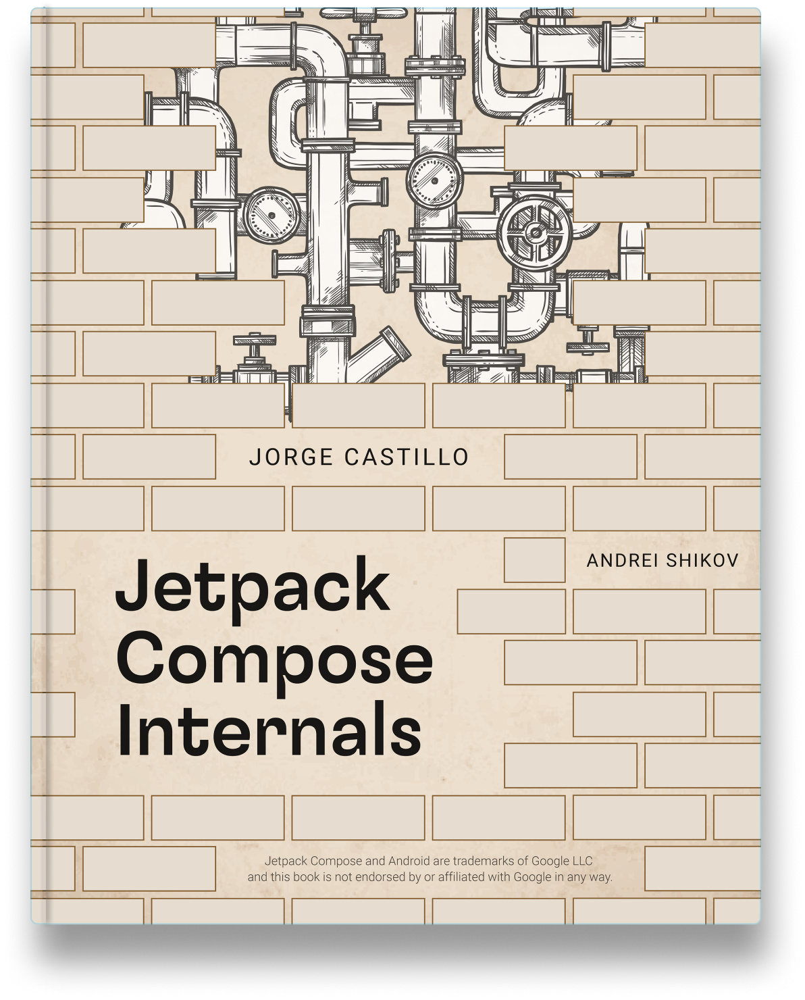

<div class="flex-container-full">
  <div style="flex-grow:1">
    <p style="margin-top:25px;">Do you wonder how Jetpack Compose works internally, or how the compiler or the runtime work together? Are you curious about other use cases for Compose? Did you ever think about how Composable functions communicate with the compiler and the runtime?</p>

    <p>It's your lucky day 🙌 <b>Jetpack Compose internals</b> is your chance to go one step further and learn the guts of what will become the new standard of Android UI.</p>

    <div class="roundedbutton"><a target="_blank" href="https://leanpub.com/composeinternals/">Get the book</a></div>
    <div class="roundedbuttonYellow"><a target="_blank" href="https://twitter.com/composeinternal/">Follow on Twitter</a></div>
    <div class="freeLabelButton"><a href="#preview">Read chapter 1 for FREE 👀</a></div>
    <div class="secondaryButton"><a href="#sponsor">Sponsor the book 👇</a></div>
  </div>
  <div style="flex-grow:1">
    
  </div>
</div>

---

<a id="preview" name="preview"></a>
<span style="background-color:#86efac; border-radius: 8px; border: 1px solid #4ade80;padding:8px;">👀 FREE content - chapter 1 for free</span>

## <span style="font-family: 'Quicksand', 'Noto Sans', sans-serif;">Composable functions</span>

### <span style="font-family: 'Quicksand', 'Noto Sans', sans-serif;">The meaning of Composable functions</span>

Probably the most adequate way to start a book about Jetpack Compose internals would be by learning about Composable functions, given those are the atomic building blocks of Jetpack Compose, and the construct we will use to write our composable trees. I intentionally say “trees” here, since composable functions can be understood as nodes in a larger tree that the Compose runtime will represent in memory. We will get to this in detail when the time comes, but it is good to start growing the correct mindset from the very beginning.
If we focus on plain syntax, any standard Kotlin function can become a Composable function just by annotating it as `@Composable`:

```kotlin
@Composable
fun NamePlate(name:String) {
  // Our composable code 
}
```

By doing this we are essentially telling the compiler that the function intends to convert some data into a node to register in the composable tree. That is, if we read a Composable function as `@Composable (Input) -> Unit`, the input would be the data, and the output would not be a value returned from the function as most people would think, but an action registered to insert the element into the tree. We could say that this happens as a side effect of executing the function.

> Note how returning `Unit` from a function that takes an input means we are likely consuming that input somehow within the body of the function.

The described action is usually known as "emitting" in the Compose jargon. Composable functions emit when executed, and that happens during the composition process. We will learn every detail about this process in the upcoming chapters. For the time being, every time we read something about "composing" a Composable function, let's simply think of it as an equivalent of "executing" it.


The only purpose of executing our Composable functions is to build or update the in-memory representation of the tree. That will keep it always up to date with the structure it represents, since Composable functions will re-execute whenever the data they read changes. To keep the tree updated, they can emit actions to insert new nodes as explained above, but they can also remove, replace, or move nodes around. Composable functions can also read or write state from/to the tree.

## Properties of Composable functions

There are other relevant implications of annotating a function as Composable. The `@Composable` annotation effectively **changes the type of the function** or expression that it is applied to, and as any other type, it imposes some constraints or properties over it. These properties are very relevant to Jetpack Compose since they unlock the library capabilities.

The Compose runtime expects Composable functions to comply to the mentioned properties, so it can assume certain behaviors and therefore exploit different runtime optimizations like parallel composition, arbitrary order of composition based on priorities, smart recomposition, or positional memoization among others. But please, don't feel overwhelmed about all these new concepts yet, we will dive into every single one in depth at the right time.

> Generically speaking, runtime optimizations are only possible when a runtime can have some certainties about the code it needs to run, so it can assume specific conditions and behaviors from it. This unlocks the chance to execute, or in other words "consume" this code following different execution strategies or evaluation techniques that take advantage of the mentioned certainties.
> 
> An example of these certainties could be the relation between the different elements in code. Are they dependant on each other or not? Can we run them in parallel or different order without affecting the program result? Can we interpret each atomic piece of logic as a completely isolated unit?

Let's learn about the properties of Composable functions.

## Calling context

Most of the properties of Composable functions are enabled by the Compose compiler. Since it is a Kotlin compiler plugin, it runs during the normal compiler phases, and has access to all the information that the Kotlin compiler has access to. This allows it to intercept and transform the IR (intermediate representation) of all the Composable functions from our sources in order to add some extra information to them.

One of the things added to each Composable function is a new parameter, at the end of the parameters list: The `Composer`. This parameter is implicit, the developer remains agnostic of it. An instance of it is injected at runtime, and forwarded to all the child Composable calls so it is accessible from all levels of the tree.


In code, let's say we have the following Composable:

```kotlin
@Composable
fun NamePlate(name: String, lastname: String) {
  Column(modifier = Modifier.padding(16.dp)) {
    Text(text = name)
    Text(text = lastname, style = MaterialTheme.typography.subtitle1)
  }
}
```

The Compiler will transform it into something like this:

```kotlin
fun NamePlate(name: String, lastname: String, $composer: Composer<*>) {
  ...
  Column(modifier = Modifier.padding(16.dp), $composer) {
    Text( 
      text = name,
      $composer
    )
    Text(
      text = lastname,
      style = MaterialTheme.typography.subtitle1,
      $composer
    )
  }
  ...
}
```

As we can see, the `Composer` is forwarded to all the Composable calls within the body. On top of this, the Compose compiler imposes a strict rule to Composable functions: They can only be called from other Composable functions. This is the actual **calling context** required, and it ensures that the tree is conformed of only Composable functions, so the `Composer` can be forwarded down.

The `Composer` is the connection between the Composable code we write as developers, and the Compose runtime. Composable functions will use it to emit their changes for the tree and therefore inform the runtime about its shape in order to build its in-memory representation or update it.

## Idempotent

Composable functions are expected to be idempotent relative to the node tree they produce. Re-executing a Composable function multiple times using the same input parameters should result in the same tree. The Jetpack Compose runtime relies on this assumption for things like recomposition.

In Jetpack Compose, **recomposition** is the action of re-executing Composable functions when their inputs vary, so they can emit updated information and update the tree. The runtime must have the ability to recompose our Composable functions at arbitrary times, and for diverse reasons. 

The recomposition process traverses down the tree checking which nodes need to be recomposed (re-executed). Only the nodes with varying inputs will recompose, and the rest will be **skipped**. Skipping a node is only possible when the Composable function representing it is idempotent, since the runtime can assume that given the same input, it will produce the same results. Those results are already in-memory, hence Compose does not need to re-execute it.

<div class="roundedbutton"><a target="_blank" href="https://leanpub.com/composeinternals/">Buy Jetpack Compose internals 💸</a></div>


## Free of uncontrolled side effects

A side effect is any action that escapes the control of the function where it is called in order to do something unexpected on the side. Things like reading from a local cache, making a network call, or setting a global variable are considered side effects. They make the calling function dependant on external factors that might influence its behavior: external state that might be written from other threads, third party apis that might throw, etc. In other words, the function does not depend on its inputs only to produce a result.

Side effects are **a source of ambiguity**. That is not great for Compose, since the runtime expects Composable functions to be predictable (deterministic), so they can be re-executed multiple times safely. If a Composable function ran side effects, it could produce a different program state on every execution, making it not idempotent.

Let's imagine that we ran a network request directly from the body of a Composable function, like this:

```kotlin
@Composable
fun EventsFeed(networkService: EventsNetworkService) {
  val events = networkService.loadAllEvents()

  LazyColumn {
    items(events) { event ->
      Text(text = event.name)
    }
  }
}
```

This would be very risky, since this function might get re-executed multiple times in a short period of time by the Compose runtime, making the network request trigger multiple times and spiral out of control. It is actually worse than that, since those executions might happen from different threads without any coordination.

> The Compose runtime reserves the right to pick the execution strategies for our Composable functions. It can offload recompositions to different threads to take advantage of multiple cores, or run them in any arbitrary order based on its own needs or priorities (E.g: Composables not showing on screen could get assigned a lower priority).

Another common caveat of side effects is that we could make a Composable function depend on the result of another Composable function, imposing a relation of order. That should be avoided at all cost. An example of this:

```kotlin
@Composable
fun MainScreen() {
  Header()
  ProfileDetail()
  EventList()
}
```

In this snippet, `Header`, `ProfileDetail` and `EventList` might execute in any order, or even in parallel. We should not write logics that assume any specific execution order, like reading an external variable from `ProfileDetail` that is expected to be written from `Header`.

Generically speaking, side effects are not ideal in Composable functions. We must try making all our Composable functions stateless, so they get all their inputs as parameters, and only use them to produce a result. This makes Composables simpler, dumber, and highly reusable. However, side effects are needed to write stateful programs, so at some level we will need to run them (frequently at the root of our Composable tree). Programs need to run network requests, persist information in databases, use memory caches, etc. For this reason, Jetpack Compose offers mechanisms to call effects from Composable functions safely and within a controlled environment: The **effect handlers**. 

Effect handlers make side effects aware of the Composable lifecycle, so they can be constrained/driven by it. They allow effects to be automatically disposed/canceled when the Composable leaves the tree, re-triggered if the effect inputs change, or even span the same effect across executions (recompositions) so it is only called once. We will cover effect handlers in detail in later chapters. They will allows us to avoid calling effects directly from the Composable's body without any control.

## Restartable

We have mentioned this a few times already. Composable functions can recompose, so they are not like standard functions, in the sense that they will not be called only once as part of a call stack. This is how a normal call stack would look. Each function gets called once, and it can call one or multiple other functions.


On the other hand, Composable functions can be restarted (re-executed, recomposed) multiple times, so the runtime keeps a reference to them in order to do so. Here is how a Composable call tree could look:


Composables 4 and 5 are re-executed after their inputs change.

Compose is selective about which nodes of the tree to restart in order to keep its in-memory representation always up to date. Composable functions are designed to be reactive and re-executed based on changes in the state they observe.

The Compose compiler finds all Composable functions that read some state and generates the code required to teach the runtime how to restart them. Composables that don't read state don't need to be restarted, so there is no reason to teach the runtime how to do so.

## Fast execution

We can think of Composable functions and the Composable function tree as a fast, declarative, and lightweight approach to build a description of the program that will be retained in memory and interpreted / materialized in a later stage.

Composable functions don't build and return UI. They simply emit data to build or update an in-memory structure. That makes them blazing fast, and allows the runtime to execute them multiple times without fear. Sometimes it happens very frequently, like for every frame of an animation.

Developers must fulfill this expectation when writing code. Any cost heavy computation should be offloaded to coroutines and always wrapped into one of the lifecycle aware effect handlers that we will learn about ahead in this book.

## Positional memoization

Positional memoization is a form of function memoization. Function memoization is the ability of a function to cache its result based on its inputs, so it does not need to be computed again every time the function is called for the same inputs. As we already learned, that is only possible for pure (**deterministic**) functions, since we have the certainty that they will always return the same result for the same inputs, hence we can cache and reuse the value.

> Function memoization is a technique widely known in the Functional Programming paradigm, where programs are defined as a composition of pure functions.

In function memoization, a function call can be identified through a combination of its name, type, and parameter values. A unique key can be created using those elements, and used to store/index/read the cached result in later calls. In Compose, an additional element is considered: Composable functions have constant knowledge about **their location in the sources**. The runtime will generate different ids (unique within the parent) when the same function is called with the same parameter values but from different places:

```kotlin
@Composable
fun MyComposable() {
  Text("Hello") // id 1
  Text("Hello") // id 2
  Text("Hello") // id 3
}
```

The in-memory tree will store three different instances of it, each one with a different identity.


Composable identity is preserved across recompositions, so the runtime can appeal to this structure to know whether a Composable was called previously, and skip it if possible.

Sometimes assigning unique identities can be hard for the Compose runtime. One example is lists of Composables generated from a loop:

```kotlin
@Composable
fun TalksScreen(talks: List<Talk>) {
  Column {
    for (talk in talks) {
      Talk(talk)
    }
  }
}
```

In this case, `Talk(talk)` is called from the same position every time, but each talk represents a different item on the list, and therefore a different node on the tree. In cases like this, the Compose runtime relies on the **order of calls** to generate the unique id, and still be able to differentiate them. This works nicely when adding a new element to the end of the list, since the rest of the calls stay in the same position as before. But what if we added elements to the top, or somewhere in the middle? The runtime would recompose all the `Talk`s below that point since they shifted their position, even if their inputs have not changed. This is highly inefficient (esp. for long lists), since those calls should have been skipped.

To solve this, Compose provides the `key` Composable, so we can assign an explicit key to the call manually:

```kotlin
@Composable
fun TalksScreen(talks: List<Talk>) {
  Column {
    for (talk in talks) {
      key(talk.id) { // Unique key
        Talk(talk)
      }
    }
  }
}
```

In this example we are using the talk id (likely unique) as the key for each `Talk`, which will allow the runtime to preserve the identity of all the items on the list **regardless of their position**.

Positional memoization allows the runtime to remember Composable functions by design. Any Composable function inferred as restartable by the Compose compiler should also be skippable, hence **automatically remembered**. Compose is built on top of this mechanism.

Sometimes developers need to appeal to this in-memory structure in a more granular way than the scope of a Composable function. Let's say we wanted to cache the result of a heavy calculation that takes place within a Composable function. The Compose runtime provides the `remember` function for that matter:

```kotlin
@Composable
fun FilteredImage(path: String) {
  val filters = remember { computeFilters(path) }
  ImageWithFiltersApplied(filters)
}

@Composable
fun ImageWithFiltersApplied(filters: List<Filter>) {
  TODO()
}
```

Here, we use `remember` to cache the result of an operation to precompute the filters of an image. The key for indexing the cached value will be based on the call position in the sources, and also the function input, which in this case is the file path. The `remember` function is just a Composable function that knows how to read from and write to the in-memory structure that holds the state of the tree. It only exposes this "positional memoization" mechanism to the developer.

In Compose, memoization is not application-wide. When something is memoized, it is done within the context of the Composable calling it. In the example from above, it would be `FilteredImage`. In practice, Compose will go to the in-memory structure and look for the value in the range of slots where the information for the enclosing Composable is stored. This makes it be more like **a singleton within that scope**. If the same Composable was called from a different parent, a new instance of the value would be returned.

<div class="roundedbutton"><a target="_blank" href="https://leanpub.com/composeinternals/">Buy Jetpack Compose internals 💸</a></div>

## Similarities with suspend functions

Kotlin `suspend` functions can only be called from other `suspend` functions, so they also require a calling context. This ensures that `suspend` functions can only be chained together, and gives the Kotlin compiler the chance to inject and forward a runtime environment across all the computation levels. This runtime is added to each `suspend` function as an extra parameter at the end of the parameters list: The `Continuation`. This paremeter is also implicit, so developers can remain agnostic of it. The `Continuation` is used to unlock some new powerful features in the language.

Sounds familiar, right?

> In the Kotlin coroutine system, a `Continuation` is like a callback. It tells the program how to continue the execution.

Here is an example. A code like the following:

```kotlin
suspend fun publishTweet(tweet: Tweet): Post = ...
```

Is replaced by the Kotlin compiler with:

```kotlin
fun publishTweet(tweet: Tweet, callback: Continuation<Post>): Unit
```

The `Continuation` carries all the information that the Kotlin runtime needs to suspend and resume execution from the different suspension points in our program. This makes `suspend` another good example of how requiring a calling context can serve as a means for carrying implicit information across the execution tree. Information that can be used at runtime to enable advanced language features.

In the same way, we could also understand `@Composable` as a language feature. It makes standard Kotlin functions restartable, reactive, etc.

> A fair question to make at this point is why the Jetpack Compose team didn't use `suspend` for achieving their wanted behavior. Well, even if both features are really similar in the pattern they implement, both are enabling completely different features in the language.
> 
> The `Continuation` interface is very specific about suspending and resuming execution, so it is modeled as a callback interface, and Kotlin generates a default implementation for it with all the required machinery to do the jumps, coordinate the different suspension points, share data between them, and so on. The Compose use case is very different, since its goal is to create an in memory representation of a large call graph that can be optimized at runtime in different ways.

Once we understand the similarities between Composable and suspend functions, it can be interesting to reflect on the idea of "function coloring".

## The color of Composable functions

Composable functions have different limitations and capabilities than standard functions. They have a different type (more on this later), and model a very specific concern. This differentiation can be understood as a form of "function coloring", since somehow they represent a separate **category of functions**.

"Function coloring" is a concept explained by Bob Nystrom from the Dart team at Google in a blockpost called ["What color is your function?"](https://journal.stuffwithstuff.com/2015/02/01/what-color-is-your-function/), written in 2015. He explained how async and sync functions don't compose well together, since you cannot call async functions from sync ones, unless you make the latter also async, or provide an awaiting mechanism that allows to call async functions and await for their result. This is why Promises and `async/await` were introduced by some libraries and languages. It was an attempt to bring composability back. Bob refers to these two function categories as two different "function colors".

In Kotlin, `suspend` aims to solve the same problem. However, `suspend` functions are also colored, since we can only call `suspend` functions from other `suspend` functions. Composing programs with a mix of standard and `suspend` functions requires some ad-hoc integration mechanism (coroutine launch points). The integration is not transparent to the developer.

Overall, this limitation is expected. We are modeling two categories of functions that represent concepts of a very different nature. It's like speaking two different languages. We have operations that are meant to calculate an immediate result (sync), and operations that unfold over time and eventually provide a result (async), which will likely take longer to complete.

In Jetpack Compose, the case of Composable functions is equivalent. We cannot call Composable functions from standard functions transparently. If we want to do that, an integration point is required (e.g: `Composition.setContent`). Composable functions have a completely different goal than standard functions. They are not designed to write program logics, but to describe changes for a node tree.

It might seem that I am tricking a bit here. One of the benefits of Composable functions is that you can declare UI using logics, actually. That means sometimes we need to call Composable functions from standard functions. For example:

```kotlin
@Composable
fun SpeakerList(speakers: List<Speaker>) {
  Column {
    speakers.forEach {
      Speaker(it)
    }
  }
}
```

The `Speaker` Composable is called from the `forEach` lambda, and the compiler does not seem to complain. How is it possible to mix function colors this way then?

The reason is `inline`. Collection operators are declared as `inline`, so they inline their lambdas into their callers making it effectively as if there was no extra indirection. In the above example, the `Speaker` Composable call is inlined within the `SpeakerList` body, and that is allowed since both are Composable functions. By leveraging `inline` we can bypass the problem of function coloring to write the logic of our Composables. Our tree will be comprised of Composable functions only.

But, is coloring really a problem?

Well, it might be if we needed to combine both types of functions and jump from one to the other all the time. However, that is not the case either for `suspend` or `@Composable`. Both mechanisms require an integration point, and therefore we gain a completely colored call stack beyond that point (everything `suspend`, or Composable). This is actually an advantage, since it allows the compiler and runtime to treat colored functions differently, and enable more advanced language features that were not possible with standard functions.

In Kotlin, `suspend` allows to model async non-blocking programs in a very idiomatic and expressive manner. The language gains the ability to represent a very complex concept in an extremely simple way: adding a `suspend` modifier to our functions. On the other hand, `@Composable` makes standard functions become restartable, skippable, and reactive, which are capabilities that standard Kotlin functions do not have.

## Composable function types

The `@Composable` annotation effectively changes the type of the function at compile time. From a syntax perspective, the type of a Composable function is `@Composable (T) -> A`, where `A` can be `Unit`, or any other type if the function returns a value (e.g: `remember`). Developers can use that type to declare Composable lambdas as one would declare any standard lambda in Kotlin.

```kotlin
// This can be reused from any Composable tree
val textComposable: @Composable (String) -> Unit = {
  Text(
    text = it,
    style = MaterialTheme.typography.subtitle1
  )
}

@Composable
fun NamePlate(name: String, lastname: String) {
  Column(modifier = Modifier.padding(16.dp)) {
    Text(
      text = name,
      style = MaterialTheme.typography.h6
    )
    textComposable(lastname)
  }
}
```

Composable functions can also have the type `@Composable Scope.() -> A`, frequently used for scoping information to a specific Composable only:

```kotlin
inline fun Box(
  ...,
  content: @Composable BoxScope.() -> Unit
) {
  // ...
  Layout(
    content = { BoxScopeInstance.content() },
    measurePolicy = measurePolicy,
    modifier = modifier
  )
}
```

From a language perspective, types exist to provide information to the compiler in order to perform quick static validation, sometimes generate some convenient code, and to delimit/refine how the data can be used at runtime. The `@Composable` annotation changes how a function is validated and used at runtime, and that is also why they are considered to have a different type than normal functions.

<div class="roundedbutton"><a target="_blank" href="https://leanpub.com/composeinternals/">Buy Jetpack Compose internals 💸</a></div>

---

<a id="preview" name="sponsor"></a>
<!-- ### <span style="font-family: 'Quicksand', 'Noto Sans', sans-serif;">Companies supporting the book</span> -->

<!--<div align="left">
  
</div>-->

<!--Build **real-time chat in less time** with Stream’s API & SDK solutions. [Activate your free Stream Chat trial](https://getstream.io/chat/trial/?utm_source=JetpackComposeInternals&utm_medium=Webpage_Content_Ad&utm_content=Developer&utm_campaign=JetpackComposeInternals_June2022_ChatTrial) to start building today.-->

<!-- > Stream is our current silver 🥈 sponsor. Thanks to their support the book price is ⏬  **cut by a 25%** ⏬ until the beginning of July. This effectively makes it more accessible to devs from around the world. Find them in [getstream.io](https://getstream.io/).-->

## <span style="font-family: 'Quicksand', 'Noto Sans', sans-serif;">Sponsoring Jetpack Compose internals</span>

Any company can become a sponsor. There are different sponsorship levels, but all of them will make the company appear in the book attributions page and in any existing book sites like [Leanpub](https://leanpub.com/composeinternals/) and this page you are reading now. *The company will provide a paragraph that will be advertised along with the company name and logo*.

Any sponsorships will have a frequent prominent position on any relevant updates about the book shared in social media.

### <span style="font-family: 'Quicksand', 'Noto Sans', sans-serif;">Sponsorship levels</span>

<div align="left" style="margin-top:40px;">
  <div style="flex-grow:1">
    <p><b>Diamond</b> 💎</p>
    <p>A Diamond sponsor makes the book <b>completely free</b> for a month, so it becomes effectively accessible to every developer in the world. A Diamond sponsor has total exclusivity, if there is a diamond sponsor, no more sponsors will be accepted.</p>
    <p><b>Platinum</b> ✨</p>
    <p>Platinum sponsors reduce the book price a 75% during a month. If there is more than one platinum sponsor, the book becomes completely free.</p>
    <p><b>Gold</b> 🥇</p>
    <p>Gold sponsors reduce the book price a 50% during a month. If there are three or more gold sponsors, the book becomes completely free.</p>
    <p><b>Silver</b> 🥈</p>
    <p>Silver sponsors reduce the book price a 25% during a month. If there are 4 silver sponsors or more, the book becomes completely free.</p>
    <p><b>Copper</b> 🥉</p>
    <p>Copper sponsors reduce the book price a 10% during a month.</p>
  </div>
</div>

### <span style="font-family: 'Quicksand', 'Noto Sans', sans-serif;">Previous sponsors</span>

<div align="left">
  
  
</div>

<div style="height: 40px;"></div>
## <span style="font-family: 'Quicksand', 'Noto Sans', sans-serif;">The book content</span>


> The book covers following topics among many others.

<div class="flex-container">
  <div>
    <b>1. Composable functions</b>
    <p style="font-size:0.8em;margin-top:20px;">
    1. The nature of Composable functions<br/>
    2. Composable function properties<br/>
    3. Calling context<br/>
    4. Idempotent<br/>
    5. Free of side effects<br/>
    6. Restartable<br/>
    7. Fast execution<br/>
    8. Positional memoization<br/>
    9. Similarities with suspend functions<br/>
    10. Composable functions are colored<br/>
    11. Composable function types<br/>
    </p>
  </div>
  <div>
    <b>2. The Compose Compiler</b>
    <p style="font-size:0.8em;margin-top:20px;">
    1. A Kotlin compiler plugin<br/>
    2. Compose annotations<br/>
    3. Registering compiler extensions<br/>
    4. Static analysis and static checkers<br/>
    5. Call, type, and declaration checks<br/>
    6. Diagnostic suppression<br/>
    7. Kotlin and runtime version checks<br/>
    8. Code generation (IR) and lowering<br/>
    9. Inferring class stability<br/>
    10. Enabling live literals<br/>
    11. Compose lambda memoization<br/>
    12. Injecting the Composer<br/>
    13. Comparison propagation<br/>
    14. Default parameters<br/>
    15. Control flow group generation<br/>
    16. Klib and decoy generation<br/>
    </p>
  </div>
  <div>
    <b>3. The Compose Runtime</b>
    <p style="font-size:0.8em;margin-top:20px;">
    1. The Slot table and the list of changes<br/>
    2. Modeling the changes<br/>
    3. The Composer and how it is fed<br/>
    4. Writing and reading groups<br/>
    5. Remembering values<br/>
    6. Recompose scopes for recomposition<br/>
    7. Side effects in the Composer<br/>
    8. Storing CompositionLocals & source info<br/>
    9. Linking Compositions as a tree<br/>
    10. The current State snapshot<br/>
    11. Navigating the tree nodes<br/>
    12. Performance when building the tree<br/>
    13. Applying the changes<br/>
    14. Attaching and drawing the nodes<br/>
    15. Composition<br/>
    16. Creating a Composition<br/>
    17. The initial Composition process<br/>
    18. Applying changes after Composition<br/>
    19. The Recomposer<br/>
    20. Recomposition process<br/>
    21. Concurrent Recomposition<br/>
    </p>
  </div>  
  <div>
    <b>4. Compose UI</b>
    <p style="font-size:0.8em;margin-top:20px;">
    1. Integrating UI with the Compose runtime<br/>
    2. Mapping scheduled changes to actual changes to the tree<br/>
    3. Composition from the point of view of Compose UI<br/>
    4. Subcomposition from the point of view of Compose UI<br/>
    5. Reflecting changes in the UI<br/>
    6. Different types of Appliers<br/>
    7. Materializing a new LayoutNode<br/>
    8. Materializing a change to remove nodes<br/>
    9. Materializing a change to move nodes<br/>
    10. Materializing a change to clear all the nodes<br/>
    11. setContent as the integration point to close the circle<br/>
    12. Measuring in Compose UI<br/>
    13. Measuring policies<br/>
    14. Intrinsic measurements<br/>
    15. Layout Constraints<br/>
    16. Modeling modifier chains<br/>
    17. Setting modifiers to the LayoutNode<br/>
    18. How LayoutNode ingests new modifiers<br/>
    19. Drawing the node tree<br/>
    20. Semantics in Jetpack Compose<br/>
    21. Notifying about semantic changes<br/>
    22. Merged and unmerged semantic trees<br/>
    </p>
  </div>
  <div>
    <b>5. The State snapshot system</b>
    <p style="font-size:0.8em;margin-top:20px;">
    1. What snapshost state is<br/>
    2. Concurrency control systems<br/>
    3. Multiversion concurrency control (MVCC)<br/>
    4. The Snapshot<br/>
    5. The snapshot tree<br/>
    6. Snapshots and threading<br/>
    7. Observing reads and writes<br/>
    8. MutableSnapshots<br/>
    9. GlobalSnapshot and nested snapshots<br/>
    10. StateObjects and StateRecords<br/>
    11. Reading and writing state<br/>
    12. Removing or reusing obsolete records<br/>
    13. Change propagation<br/>
    14. Merging write conflicts<br/>
    </p>
  </div>
  <div>
    <b>6. Smart recomposition</b>
    <p style="font-size:0.8em;margin-top:20px;color:gray;">
    1. To be written<br/>
    2. To be written<br/>
    3. To be written<br/>
    4. To be written<br/>
    5. To be written<br/>
    6. To be written<br/>
    7. To be written<br/>
    8. To be written<br/>
    9. To be written<br/>
    10. To be written<br/>
    11. To be written<br/>
    12. To be written<br/>
    13. To be written<br/>
    14. To be written<br/>
    </p>
  </div>  
  <div>
    <b>7. Effects and effect handlers</b>
    <p style="font-size:0.8em;margin-top:20px;">
    1. Introducing side effects<br/>
    2. Side effects in Compose<br/>
    3. What we need<br/>
    4. Effect handlers<br/>
    5. Non suspended effects<br/>
    6. Suspended effects<br/>
    7. Third party library adapters<br/>
    </p>
  </div>
  <div>
    <b>8. The Composable lifecycle</b>
    <p style="font-size:0.8em;margin-top:20px;color:gray;">
    1. To be written<br/>
    2. To be written<br/>
    3. To be written<br/>
    4. To be written<br/>
    5. To be written<br/>
    6. To be written<br/>
    7. To be written<br/>
    </p>
  </div>
  <div>
    <b>9. Advanced Compose use cases</b>
    <p style="font-size:0.8em;margin-top:20px;">
    1. Compose runtime vs Compose UI<br/>
    2. Composition of vector graphics<br/>
    3. Building vector image tree<br/>
    4. Integrating vector composition into Compose UI<br/>
    5. Managing DOM with Compose<br/>
    6. Standalone composition in the browser<br/>
    7. Conclusion<br/>
    </p>
  </div>
</div>

### <span style="font-family: 'Quicksand', 'Noto Sans', sans-serif;">The authors and the project</span>

This book is being written by me ([Jorge Castillo](https://www.twitter.com/JorgeCastilloPR)) and [Andrei Shikov](https://twitter.com/shikasd_).

I started writing this book around a year ago, and it helped me to escape a bit from the events happening around and focus on something interesting. It started as a series of posts and suddenly became a book. It is a chance to challenge myself and learn more about a new technology. A great consequence is to be able to share all the gathered knowledge with others 🥳

To write this book we explored the Jetpack Compose sources via [cs.android.com](https://cs.android.com) and sources included in Android Studio. We also had to built our own side projects.

This book aims to gather all the relevant knowledge about Jetpack Compose internals so it works as a reference for the years to come. Jetpack Compose is the future of Android UI, but it will also gain relevance in other platforms given its multiplatform nature.

<div style="height:20px;"></div>

### <span style="font-family: 'Quicksand', 'Noto Sans', sans-serif;">Support me by buying the book</span>

By buying the book you are not only rewarding the countless hours of effort invested, but also boosting my motivation to keep working on it 🙏

<div class="roundedbutton"><a target="_blank" href="https://leanpub.com/composeinternals/">Get the book</a></div>
<div class="roundedbuttonYellow"><a target="_blank" href="https://twitter.com/composeinternal/">Follow on Twitter</a></div>

---


<div align="center" style="margin-bottom:20px"><b>Manuel Vivo</b></div>

> "Certainly one of the best resources to learn about the internals of Jetpack Compose. The details in which everything is explained in the book are mind-blowing. 100% recommended for any developer interested in what Jetpack Compose does under the hood. Disclaimer: it does a lot!"


<div align="center" style="margin-bottom:20px"><b>Joe Birch</b></div>

> "Being clearly explained and easily consumable, Jorge's Jetpack Compose content has been a great learning resource. I'm really looking forward to picking up this book and soaking up all of the knowledge around these Compose topics!"


<div align="center" style="margin-bottom:20px"><b>Antonio Leiva</b></div>

> "Jorge is able to explain hard concepts in the simplest possible way. This book is another proof of his teaching abilities."


<div align="center" style="margin-bottom:20px"><b>Enrique López-Mañas</b></div>

> "Jorge has done an astonishing job at presenting Compose and its internal to the masses. I can absolutely endorse his book for any developer interested in the peculiarities of Compose and eager to learn more about it."


<div align="center" style="margin-bottom:20px"><b>Andrei Shikov</b></div>

> "Jorge did an amazing job explaining how Compose works in smallest detail, and there's so much more to it than only displaying UI. I thoroughly enjoyed hacking different things based on it, and I hope you will too!"


<div align="center" style="margin-bottom:20px"><b>Jorge Castillo</b></div>

> "This book is one of the hardest challenges I've faced as a developer. I've put all my love and effort on creating a consciously crafted piece of knowledge."

<div style="height:20px;"></div>

### <span style="font-family: 'Quicksand', 'Noto Sans', sans-serif;">Support me by buying the book</span>

By buying the book you are not only rewarding the countless hours of effort invested, but also boosting my motivation to keep working on it 🙏

<div class="roundedbutton"><a target="_blank" href="https://leanpub.com/composeinternals/">Get the book</a></div>
<div class="roundedbuttonYellow"><a target="_blank" href="https://twitter.com/composeinternal/">Follow on Twitter</a></div>
<div class="freeLabelButton"><a href="#preview">Read chapter 1 for FREE 👀👆</a></div>
<div class="secondaryButton"><a href="#sponsor">Sponsor the book 👆</a></div>
