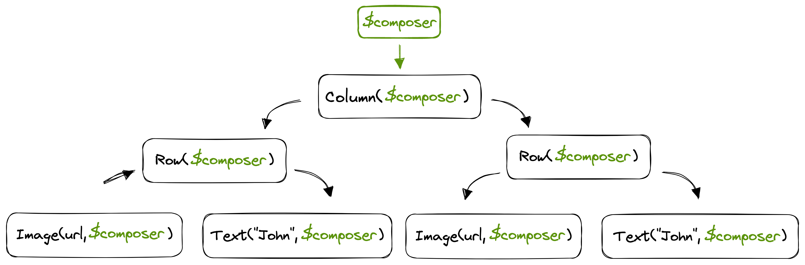

  

    
Master Jetpack Compose and its internals. Learn how to work efficiently with it by going through the weekly stages of this course. Join others and interact with them and the trainer while progressing over the content together 🚀
    

    

      

        
            
        
        
            
        
        
              
          
        
              
          
        
              
          
        
            
          
      

    

    
    

      <a class="font-recoleta blackBtnLarge" href="#next-cohort">Join next cohort 🔥</a>
      <a class="font-recoleta transparentBtnLarge" href="#what-i-get">What I get</a>
    

    
  

  

    

      

        <iframe src="https://www.youtube.com/embed/XrTp406sgM4" frameborder="0" allow="accelerometer; autoplay; clipboard-write; encrypted-media; gyroscope; picture-in-picture; web-share" allowfullscreen></iframe>
      

      

        
        Created and delivered by <b>Jorge Castillo</b>, author of Jetpack Compose internals, Google Developer Expert for Android and Kotlin. Formerly working at Twitter.
      

    

  

  

---

## Can I take this course?

You can take it either if you are starting with Jetpack Compose or you want to master it. Only medium Android level is required (UI, architecture, testing), and medium Kotlin level (suspend + coroutines).

## What I get

By enrolling you get access to all these things, all inclusive of the one-time signup fee. Each cohort has a 🔔 **limited number of seats** 🔔 to ensure a high level of interaction. All the content is recorded, so you can consume it at your own pace or follow the group. Whatever you prefer 🙌

<ul style="list-style-type: none; padding: 0;">
  <li>✅ Lifetime access to this course. Take it as many times as you want!</li>
  <li>✅ Unlimited access to the Effective Android Discord community. Join hundreds of devs already there!</li>
  <li>✅ Free access to the <a href="https://leanpub.com/composeinternals" target="_blank">Jetpack Compose internals book</a> and all its future updates in all formats</li>
  <li>✅ Completion certificate signed by me</li>
</ul>

  
  Next cohort
  

  Join other several attendees for the next cohort before we run out of slots 🗣️
  

  <ul>
    <li>🗓 Starts on January 8, 2024</li>
    <li>⏱ Spans over 8 weeks (1 stage a week)</li>
    <li>🚨 <b>Limited number of seats available</b></li>
  </ul>

  

    <a class="font-recoleta blackBtnLarge" target="_blank" href="https://book.stripe.com/aEUeWGbj23ztg9y6oH">Join next cohort 🔥</a>
  

## The stages

The course consists of 8 stages of 1 week duration. They include several recordings and self-validated exercises. Join other attendees to go through each Stage. Discuss any doubts and details with me and the rest of the attendees in our exclusive Discord community 👥

  

    <ul
      role="list"
      class="list-none mx-auto mt-16 p-0 grid grid-cols-1 lg:mt-20 lg:max-w-none grid-cols-1"
    >
        <li class="p-0 m-0">
          <ul role="list" class="px-4 my-0 list-none flex flex-col">
              <li>
                <figure class="relative rounded-2xl bg-white p-6 shadow-xl shadow-slate-900/10">
                  <figcaption class="relative flex items-center justify-between border-t border-slate-100">
                    

                      

                        Stage 1 - Essentials
                      

                      

                        week 1
                      

                    

                    

                        <svg xmlns="http://www.w3.org/2000/svg" fill="none" width=64 height=64 viewBox="0 0 24 24" stroke-width="1.5" class="stroke-sky-700 w-20 h-20">
                          <path stroke-linecap="round" stroke-linejoin="round" d="M9 12.75L11.25 15 15 9.75M21 12c0 1.268-.63 2.39-1.593 3.068a3.745 3.745 0 01-1.043 3.296 3.745 3.745 0 01-3.296 1.043A3.745 3.745 0 0112 21c-1.268 0-2.39-.63-3.068-1.593a3.746 3.746 0 01-3.296-1.043 3.745 3.745 0 01-1.043-3.296A3.745 3.745 0 013 12c0-1.268.63-2.39 1.593-3.068a3.745 3.745 0 011.043-3.296 3.746 3.746 0 013.296-1.043A3.746 3.746 0 0112 3c1.268 0 2.39.63 3.068 1.593a3.746 3.746 0 013.296 1.043 3.746 3.746 0 011.043 3.296A3.745 3.745 0 0121 12z" />
                        </svg>
                    

                  </figcaption>
                  

                    🎒  This is where the journey starts. Learn the essentials of Jetpack Compose while building the foundations of our course project from scratch. Join other attendees to build the first app screen to load and display a list of speakers making use of all the essentials of the library. <a href="#stage-1">Show all the details</a>
                  

                </figure>
              </li>
              <li>
                <figure class="relative rounded-2xl bg-white p-6 shadow-xl shadow-slate-900/10">
                  <figcaption class="relative flex items-center justify-between border-t border-purple-700">
                    

                      

                        Stage 2 - UI
                      

                      

                        week 2
                      

                    

                    

                        <svg xmlns="http://www.w3.org/2000/svg" fill="none" viewBox="0 0 24 24" stroke-width="1.5" class="stroke-purple-700 w-20 h-20">
                          <path stroke-linecap="round" stroke-linejoin="round" d="M9 12.75L11.25 15 15 9.75M21 12c0 1.268-.63 2.39-1.593 3.068a3.745 3.745 0 01-1.043 3.296 3.745 3.745 0 01-3.296 1.043A3.745 3.745 0 0112 21c-1.268 0-2.39-.63-3.068-1.593a3.746 3.746 0 01-3.296-1.043 3.745 3.745 0 01-1.043-3.296A3.745 3.745 0 013 12c0-1.268.63-2.39 1.593-3.068a3.745 3.745 0 011.043-3.296 3.746 3.746 0 013.296-1.043A3.746 3.746 0 0112 3c1.268 0 2.39.63 3.068 1.593a3.746 3.746 0 013.296 1.043 3.746 3.746 0 011.043 3.296A3.745 3.745 0 0121 12z" />
                        </svg>
                    

                  </figcaption>
                  

                      👩‍🎨 Master Compose UI. Join the group to learn how to build neat UIs using Compose UI, Material Design, and the Foundation components. We will start using basic and advanced modifiers, and build a detail screen that uses a custom Layout for one of its UI elements. Learn how measuring and drawing works in Compose. <a href="#stage-2">Show all the details</a>
                    

                </figure>
              </li>
              <li>
                <figure class="relative rounded-2xl bg-white p-6 shadow-xl shadow-slate-900/10">
                  <figcaption class="relative flex items-center justify-between border-t border-slate-100">
                    

                      

                        Stage 3 - State
                      

                      

                        week 3
                      

                    

                    

                        <svg xmlns="http://www.w3.org/2000/svg" fill="none" width=64 height=64 viewBox="0 0 24 24" stroke-width="1.5" class="stroke-rose-500 w-20 h-20">
                          <path stroke-linecap="round" stroke-linejoin="round" d="M9 12.75L11.25 15 15 9.75M21 12c0 1.268-.63 2.39-1.593 3.068a3.745 3.745 0 01-1.043 3.296 3.745 3.745 0 01-3.296 1.043A3.745 3.745 0 0112 21c-1.268 0-2.39-.63-3.068-1.593a3.746 3.746 0 01-3.296-1.043 3.745 3.745 0 01-1.043-3.296A3.745 3.745 0 013 12c0-1.268.63-2.39 1.593-3.068a3.745 3.745 0 011.043-3.296 3.746 3.746 0 013.296-1.043A3.746 3.746 0 0112 3c1.268 0 2.39.63 3.068 1.593a3.746 3.746 0 013.296 1.043 3.746 3.746 0 011.043 3.296A3.745 3.745 0 0121 12z" />
                        </svg>
                    

                  </figcaption>
                  

                      🔄 Introducing Snapshot State. How to declare state, read from and write to it. How recomposition works from the compiler and runtime perspective. The different types of state, and where to put them. In this stage we add state to our app, and see how modifying it triggers recomposition. We'll use of derived state and <a href="https://effectiveandroid.substack.com/p/movablecontentof-and-movablecontentwithreceivero" target="_blank">movable content</a>.
                    

                </figure>
              </li>
              <li>
                <figure class="relative rounded-2xl bg-white p-6 shadow-xl shadow-slate-900/10">
                  <figcaption class="relative flex items-center justify-between border-t border-slate-100">
                    

                      

                        Stage 4 - Effects
                      

                      

                        week 4
                      

                    

                    

                        <svg xmlns="http://www.w3.org/2000/svg" fill="none" width=64 height=64 viewBox="0 0 24 24" stroke-width="1.5" class="stroke-orange-500 w-20 h-20">
                          <path stroke-linecap="round" stroke-linejoin="round" d="M9 12.75L11.25 15 15 9.75M21 12c0 1.268-.63 2.39-1.593 3.068a3.745 3.745 0 01-1.043 3.296 3.745 3.745 0 01-3.296 1.043A3.745 3.745 0 0112 21c-1.268 0-2.39-.63-3.068-1.593a3.746 3.746 0 01-3.296-1.043 3.745 3.745 0 01-1.043-3.296A3.745 3.745 0 013 12c0-1.268.63-2.39 1.593-3.068a3.745 3.745 0 011.043-3.296 3.746 3.746 0 013.296-1.043A3.746 3.746 0 0112 3c1.268 0 2.39.63 3.068 1.593a3.746 3.746 0 013.296 1.043 3.746 3.746 0 011.043 3.296A3.745 3.745 0 0121 12z" />
                        </svg>
                    

                  </figcaption>
                  

                      🌀 What is a side effect, how to call effects safely in Compose, and the types of effect handlers available. Examples of when to use each one. Exercises in this stage are about making the project side effects lifecycle aware, so they can span across recompositions or get disposed / cancelled when required. We will use a few of the effect handlers available in Compose.
                    

                </figure>
              </li>
              <li>
                <figure class="relative rounded-2xl bg-white p-6 shadow-xl shadow-slate-900/10">
                  <figcaption class="relative flex items-center justify-between border-t border-slate-100">
                    

                      

                        Stage 5 - Architecture
                      

                      

                        week 5
                      

                    

                    

                        <svg xmlns="http://www.w3.org/2000/svg" fill="none" width=64 height=64 viewBox="0 0 24 24" stroke-width="1.5" class="stroke-yellow-500 w-20 h-20">
                          <path stroke-linecap="round" stroke-linejoin="round" d="M9 12.75L11.25 15 15 9.75M21 12c0 1.268-.63 2.39-1.593 3.068a3.745 3.745 0 01-1.043 3.296 3.745 3.745 0 01-3.296 1.043A3.745 3.745 0 0112 21c-1.268 0-2.39-.63-3.068-1.593a3.746 3.746 0 01-3.296-1.043 3.745 3.745 0 01-1.043-3.296A3.745 3.745 0 013 12c0-1.268.63-2.39 1.593-3.068a3.745 3.745 0 011.043-3.296 3.746 3.746 0 013.296-1.043A3.746 3.746 0 0112 3c1.268 0 2.39.63 3.068 1.593a3.746 3.746 0 013.296 1.043 3.746 3.746 0 011.043 3.296A3.745 3.745 0 0121 12z" />
                        </svg>
                    

                  </figcaption>
                  

                      🧱 Integrating Compose with our existing architecture. Architecture recommendations and tips for optimal architecture with Compose. Testing is also covered in this stage, including UI and screenshot tests. In this stage we extract our UI state into AAC ViewModels and make it support configuration changes and process death. We will refactor our project to build an optimal architecture.
                    

                </figure>
              </li>
              <li>
                <figure class="relative rounded-2xl bg-white p-6 shadow-xl shadow-slate-900/10">
                  <figcaption class="relative flex items-center justify-between border-t border-slate-100">
                    

                      

                        Stage 6 - Themes & CompositionLocals
                      

                      

                        week 6
                      

                    

                    

                        <svg xmlns="http://www.w3.org/2000/svg" fill="none" width=64 height=64 viewBox="0 0 24 24" stroke-width="1.5" class="stroke-emerald-500 w-20 h-20">
                          <path stroke-linecap="round" stroke-linejoin="round" d="M9 12.75L11.25 15 15 9.75M21 12c0 1.268-.63 2.39-1.593 3.068a3.745 3.745 0 01-1.043 3.296 3.745 3.745 0 01-3.296 1.043A3.745 3.745 0 0112 21c-1.268 0-2.39-.63-3.068-1.593a3.746 3.746 0 01-3.296-1.043 3.745 3.745 0 01-1.043-3.296A3.745 3.745 0 013 12c0-1.268.63-2.39 1.593-3.068a3.745 3.745 0 011.043-3.296 3.746 3.746 0 013.296-1.043A3.746 3.746 0 0112 3c1.268 0 2.39.63 3.068 1.593a3.746 3.746 0 013.296 1.043 3.746 3.746 0 011.043 3.296A3.745 3.745 0 0121 12z" />
                        </svg>
                    

                  </figcaption>
                  

                      🎨 How themes work, the concept of composition locals, what to use them for. Here we add a theme to our app, we make it look good following the material design theme and components, we learn how to extend it and create custom themes. We will add support for dark and light modes, and dynamic theme following the system wallpaper.
                    

                </figure>
              </li>
              <li>
                <figure class="relative rounded-2xl bg-white p-6 shadow-xl shadow-slate-900/10">
                  <figcaption class="relative flex items-center justify-between border-t border-slate-100">
                    

                      

                        Stage 7 - Animations
                      

                      

                        week 7
                      

                    

                    

                        <svg xmlns="http://www.w3.org/2000/svg" fill="none" width=64 height=64 viewBox="0 0 24 24" stroke-width="1.5" class="stroke-fuchsia-500 w-20 h-20">
                          <path stroke-linecap="round" stroke-linejoin="round" d="M9 12.75L11.25 15 15 9.75M21 12c0 1.268-.63 2.39-1.593 3.068a3.745 3.745 0 01-1.043 3.296 3.745 3.745 0 01-3.296 1.043A3.745 3.745 0 0112 21c-1.268 0-2.39-.63-3.068-1.593a3.746 3.746 0 01-3.296-1.043 3.745 3.745 0 01-1.043-3.296A3.745 3.745 0 013 12c0-1.268.63-2.39 1.593-3.068a3.745 3.745 0 011.043-3.296 3.746 3.746 0 013.296-1.043A3.746 3.746 0 0112 3c1.268 0 2.39.63 3.068 1.593a3.746 3.746 0 013.296 1.043 3.746 3.746 0 011.043 3.296A3.745 3.745 0 0121 12z" />
                        </svg>
                    

                  </figcaption>
                  

                      🎬 We learn animations in Compose. How they work via suspend, the different apis available. In this stage we make use of a companion app, the "animationtester" to test animations. We will add some animations to our Android app. Some basic ones and also a few advanced ones. We will also learn how to test animations!
                    

                </figure>
              </li>
              <li>
                <figure class="relative rounded-2xl bg-white p-6 shadow-xl shadow-slate-900/10">
                  <figcaption class="relative flex items-center justify-between border-t border-slate-100">
                    

                      

                        Stage 8 - Other use cases of Compose
                      

                      

                        week 8
                      

                    

                    

                        <svg xmlns="http://www.w3.org/2000/svg" fill="none" width=64 height=64 viewBox="0 0 24 24" stroke-width="1.5" class="stroke-yellow-700 w-20 h-20">
                          <path stroke-linecap="round" stroke-linejoin="round" d="M9 12.75L11.25 15 15 9.75M21 12c0 1.268-.63 2.39-1.593 3.068a3.745 3.745 0 01-1.043 3.296 3.745 3.745 0 01-3.296 1.043A3.745 3.745 0 0112 21c-1.268 0-2.39-.63-3.068-1.593a3.746 3.746 0 01-3.296-1.043 3.745 3.745 0 01-1.043-3.296A3.745 3.745 0 013 12c0-1.268.63-2.39 1.593-3.068a3.745 3.745 0 011.043-3.296 3.746 3.746 0 013.296-1.043A3.746 3.746 0 0112 3c1.268 0 2.39.63 3.068 1.593a3.746 3.746 0 013.296 1.043 3.746 3.746 0 011.043 3.296A3.745 3.745 0 0121 12z" />
                        </svg>
                    

                  </figcaption>
                  

                      ⚙️ Join the group to learn other use cases of Jetpack Compose. Creating client libraries for the Compose runtime. Mosaic practical case study. Introduction to Compose multiplatform, Compose for Desktop, and Compose for Web.
                    

                </figure>
              </li>
          </ul>
        </li>
    </ul>
  

  <a class="font-recoleta blackBtnLarge" target="_blank" href="https://book.stripe.com/aEUeWGbj23ztg9y6oH">Join next cohort 🔥</a>

## The ultimate goal

This course takes you further and deeper than any other existing Jetpack Compose course. It has been consciously crafted so previous knowledge of the library is not needed, only some experience in Android development. The course starts from the library essentials and guides you gently towards the most advanced and efficient use of the library. This makes it a perfect fit for teams or individuals wanting to learn and master Jetpack Compose.

  

    

      
        Testimonials from attendees
      
      

        Join hundreds of people who already attended this training. This is what they are saying 🗣️
      

    

    <ul
      role="list"
      class="list-none mx-auto mt-16 p-0 grid grid-cols-1 lg:mt-20 lg:max-w-none md:grid-cols-2 lg:grid-cols-2 xl:grid-cols-3"
    >
        <li class="p-0 m-0">
          <ul role="list" class="px-4 my-0 list-none flex flex-col">
              <li>
                <figure class="relative rounded-2xl bg-white p-6 shadow-xl shadow-slate-900/10">
                  <svg aria-hidden="true" width=105 height=105 class="absolute top-6 left-6 fill-slate-100">
                    <path d="M25.086 77.292c-4.821 0-9.115-1.205-12.882-3.616-3.767-2.561-6.78-6.102-9.04-10.622C1.054 58.534 0 53.411 0 47.686c0-5.273.904-10.396 2.712-15.368 1.959-4.972 4.746-9.567 8.362-13.786a59.042 59.042 0 0 1 12.43-11.3C28.325 3.917 33.599 1.507 39.324 0l11.074 13.786c-6.479 2.561-11.677 5.951-15.594 10.17-3.767 4.219-5.65 7.835-5.65 10.848 0 1.356.377 2.863 1.13 4.52.904 1.507 2.637 3.089 5.198 4.746 3.767 2.41 6.328 4.972 7.684 7.684 1.507 2.561 2.26 5.5 2.26 8.814 0 5.123-1.959 9.19-5.876 12.204-3.767 3.013-8.588 4.52-14.464 4.52Zm54.24 0c-4.821 0-9.115-1.205-12.882-3.616-3.767-2.561-6.78-6.102-9.04-10.622-2.11-4.52-3.164-9.643-3.164-15.368 0-5.273.904-10.396 2.712-15.368 1.959-4.972 4.746-9.567 8.362-13.786a59.042 59.042 0 0 1 12.43-11.3C82.565 3.917 87.839 1.507 93.564 0l11.074 13.786c-6.479 2.561-11.677 5.951-15.594 10.17-3.767 4.219-5.65 7.835-5.65 10.848 0 1.356.377 2.863 1.13 4.52.904 1.507 2.637 3.089 5.198 4.746 3.767 2.41 6.328 4.972 7.684 7.684 1.507 2.561 2.26 5.5 2.26 8.814 0 5.123-1.959 9.19-5.876 12.204-3.767 3.013-8.588 4.52-14.464 4.52Z" />
                  </svg>
                  

                      My team and I took the Jetpack Compose and Internals course. It was just what we needed to make the choice to write all new UI in Compose. We all left with a much better understanding of how the library works on the inside. As well as, actionable tips for developing performant Compose layouts. I highly recommend it!
                    

                  <figcaption class="relative mt-6 flex items-center justify-between border-t border-slate-100 pt-6">
                    

                      

                        Annyce Davis
                      

                      

                        👩🏽‍💻 VP of Engineering @Meetup
                      

                    

                    

                      
                    

                  </figcaption>
                </figure>
              </li>
              <li>
                <figure class="relative rounded-2xl bg-white p-6 shadow-xl shadow-slate-900/10">
                  <svg aria-hidden="true" width=105 height=105 class="absolute top-6 left-6 fill-slate-100">
                    <path d="M25.086 77.292c-4.821 0-9.115-1.205-12.882-3.616-3.767-2.561-6.78-6.102-9.04-10.622C1.054 58.534 0 53.411 0 47.686c0-5.273.904-10.396 2.712-15.368 1.959-4.972 4.746-9.567 8.362-13.786a59.042 59.042 0 0 1 12.43-11.3C28.325 3.917 33.599 1.507 39.324 0l11.074 13.786c-6.479 2.561-11.677 5.951-15.594 10.17-3.767 4.219-5.65 7.835-5.65 10.848 0 1.356.377 2.863 1.13 4.52.904 1.507 2.637 3.089 5.198 4.746 3.767 2.41 6.328 4.972 7.684 7.684 1.507 2.561 2.26 5.5 2.26 8.814 0 5.123-1.959 9.19-5.876 12.204-3.767 3.013-8.588 4.52-14.464 4.52Zm54.24 0c-4.821 0-9.115-1.205-12.882-3.616-3.767-2.561-6.78-6.102-9.04-10.622-2.11-4.52-3.164-9.643-3.164-15.368 0-5.273.904-10.396 2.712-15.368 1.959-4.972 4.746-9.567 8.362-13.786a59.042 59.042 0 0 1 12.43-11.3C82.565 3.917 87.839 1.507 93.564 0l11.074 13.786c-6.479 2.561-11.677 5.951-15.594 10.17-3.767 4.219-5.65 7.835-5.65 10.848 0 1.356.377 2.863 1.13 4.52.904 1.507 2.637 3.089 5.198 4.746 3.767 2.41 6.328 4.972 7.684 7.684 1.507 2.561 2.26 5.5 2.26 8.814 0 5.123-1.959 9.19-5.876 12.204-3.767 3.013-8.588 4.52-14.464 4.52Z" />
                  </svg>
                  

                      The course was very engaging and the exercises were very useful for establishing concepts and stimulating questions to which Jorge answered exhaustively. I now have a better understanding of several aspects of Compose and this will definitely help me write better code. Super recommended ⭐️⭐️⭐️⭐️⭐️
                    

                  <figcaption class="relative mt-6 flex items-center justify-between border-t border-slate-100 pt-6">
                    

                      

                        Aurelio Laudiero
                      

                      

                        Android dev @Capgemini
                      

                    

                    

                      
                    

                  </figcaption>
                </figure>
              </li>
              <li>
                <figure class="relative rounded-2xl bg-white p-6 shadow-xl shadow-slate-900/10">
                  <svg aria-hidden="true" width=105 height=105 class="absolute top-6 left-6 fill-slate-100">
                    <path d="M25.086 77.292c-4.821 0-9.115-1.205-12.882-3.616-3.767-2.561-6.78-6.102-9.04-10.622C1.054 58.534 0 53.411 0 47.686c0-5.273.904-10.396 2.712-15.368 1.959-4.972 4.746-9.567 8.362-13.786a59.042 59.042 0 0 1 12.43-11.3C28.325 3.917 33.599 1.507 39.324 0l11.074 13.786c-6.479 2.561-11.677 5.951-15.594 10.17-3.767 4.219-5.65 7.835-5.65 10.848 0 1.356.377 2.863 1.13 4.52.904 1.507 2.637 3.089 5.198 4.746 3.767 2.41 6.328 4.972 7.684 7.684 1.507 2.561 2.26 5.5 2.26 8.814 0 5.123-1.959 9.19-5.876 12.204-3.767 3.013-8.588 4.52-14.464 4.52Zm54.24 0c-4.821 0-9.115-1.205-12.882-3.616-3.767-2.561-6.78-6.102-9.04-10.622-2.11-4.52-3.164-9.643-3.164-15.368 0-5.273.904-10.396 2.712-15.368 1.959-4.972 4.746-9.567 8.362-13.786a59.042 59.042 0 0 1 12.43-11.3C82.565 3.917 87.839 1.507 93.564 0l11.074 13.786c-6.479 2.561-11.677 5.951-15.594 10.17-3.767 4.219-5.65 7.835-5.65 10.848 0 1.356.377 2.863 1.13 4.52.904 1.507 2.637 3.089 5.198 4.746 3.767 2.41 6.328 4.972 7.684 7.684 1.507 2.561 2.26 5.5 2.26 8.814 0 5.123-1.959 9.19-5.876 12.204-3.767 3.013-8.588 4.52-14.464 4.52Z" />
                  </svg>
                  

                      As a member of the design team at Turo, we've been fully invested in using Compose to build our design system. After taking Jorge's class, I feel much more confident in my ability to work with this powerful framework. The hands-on exercises were my favorite part, as they helped to solidify my understanding and encouraged engagement 💯
                    

                  <figcaption class="relative mt-6 flex items-center justify-between border-t border-slate-100 pt-6">
                    

                      

                        Francisco Velazquez
                      

                      

                        Sr. Software Engineer at Turo
                      

                    

                    

                      
                    

                  </figcaption>
                </figure>
              </li>
          </ul>
        </li>

        <li class="p-0 m-0">
          <ul role="list" class="px-4 my-0 list-none flex flex-col">
              <li>
                <figure class="relative rounded-2xl bg-white p-6 shadow-xl shadow-slate-900/10">
                  <svg aria-hidden="true" width=105 height=105 class="absolute top-6 left-6 fill-slate-100">
                    <path d="M25.086 77.292c-4.821 0-9.115-1.205-12.882-3.616-3.767-2.561-6.78-6.102-9.04-10.622C1.054 58.534 0 53.411 0 47.686c0-5.273.904-10.396 2.712-15.368 1.959-4.972 4.746-9.567 8.362-13.786a59.042 59.042 0 0 1 12.43-11.3C28.325 3.917 33.599 1.507 39.324 0l11.074 13.786c-6.479 2.561-11.677 5.951-15.594 10.17-3.767 4.219-5.65 7.835-5.65 10.848 0 1.356.377 2.863 1.13 4.52.904 1.507 2.637 3.089 5.198 4.746 3.767 2.41 6.328 4.972 7.684 7.684 1.507 2.561 2.26 5.5 2.26 8.814 0 5.123-1.959 9.19-5.876 12.204-3.767 3.013-8.588 4.52-14.464 4.52Zm54.24 0c-4.821 0-9.115-1.205-12.882-3.616-3.767-2.561-6.78-6.102-9.04-10.622-2.11-4.52-3.164-9.643-3.164-15.368 0-5.273.904-10.396 2.712-15.368 1.959-4.972 4.746-9.567 8.362-13.786a59.042 59.042 0 0 1 12.43-11.3C82.565 3.917 87.839 1.507 93.564 0l11.074 13.786c-6.479 2.561-11.677 5.951-15.594 10.17-3.767 4.219-5.65 7.835-5.65 10.848 0 1.356.377 2.863 1.13 4.52.904 1.507 2.637 3.089 5.198 4.746 3.767 2.41 6.328 4.972 7.684 7.684 1.507 2.561 2.26 5.5 2.26 8.814 0 5.123-1.959 9.19-5.876 12.204-3.767 3.013-8.588 4.52-14.464 4.52Z" />
                  </svg>
                  

                      Super insightful course. The intuitive diagrams gave me new clarity about the library’s inner workings. Despite having some prior experience with Jetpack Compose, I learned new things and felt more confident to explore the source code on my own. Recommended for a deeper understanding of the libraries 💯
                    

                  <figcaption class="relative mt-6 flex items-center justify-between border-t border-slate-100 pt-6">
                    

                      

                        Tasha Ramesh
                      

                      

                        Android Engineer @Tinder
                      

                    

                    

                      
                    

                  </figcaption>
                </figure>
              </li>
              <li>
                <figure class="relative rounded-2xl bg-white p-6 shadow-xl shadow-slate-900/10">
                  <svg aria-hidden="true" width=105 height=105 class="absolute top-6 left-6 fill-slate-100">
                    <path d="M25.086 77.292c-4.821 0-9.115-1.205-12.882-3.616-3.767-2.561-6.78-6.102-9.04-10.622C1.054 58.534 0 53.411 0 47.686c0-5.273.904-10.396 2.712-15.368 1.959-4.972 4.746-9.567 8.362-13.786a59.042 59.042 0 0 1 12.43-11.3C28.325 3.917 33.599 1.507 39.324 0l11.074 13.786c-6.479 2.561-11.677 5.951-15.594 10.17-3.767 4.219-5.65 7.835-5.65 10.848 0 1.356.377 2.863 1.13 4.52.904 1.507 2.637 3.089 5.198 4.746 3.767 2.41 6.328 4.972 7.684 7.684 1.507 2.561 2.26 5.5 2.26 8.814 0 5.123-1.959 9.19-5.876 12.204-3.767 3.013-8.588 4.52-14.464 4.52Zm54.24 0c-4.821 0-9.115-1.205-12.882-3.616-3.767-2.561-6.78-6.102-9.04-10.622-2.11-4.52-3.164-9.643-3.164-15.368 0-5.273.904-10.396 2.712-15.368 1.959-4.972 4.746-9.567 8.362-13.786a59.042 59.042 0 0 1 12.43-11.3C82.565 3.917 87.839 1.507 93.564 0l11.074 13.786c-6.479 2.561-11.677 5.951-15.594 10.17-3.767 4.219-5.65 7.835-5.65 10.848 0 1.356.377 2.863 1.13 4.52.904 1.507 2.637 3.089 5.198 4.746 3.767 2.41 6.328 4.972 7.684 7.684 1.507 2.561 2.26 5.5 2.26 8.814 0 5.123-1.959 9.19-5.876 12.204-3.767 3.013-8.588 4.52-14.464 4.52Z" />
                  </svg>
                  

                      Jorge progressively builds from simple to more complex topics making it easier to understand different components of compose library. The practice exercises and Jorge's prompt responses to questions made the course more lively. I'd highly recommend the course ⭐️⭐️⭐️⭐️⭐️
                    

                  <figcaption class="relative mt-6 flex items-center justify-between border-t border-slate-100 pt-6">
                    

                      

                        Beatrice Kinya
                      

                      

                        Android Eng Kyosk Digital
                      

                    

                    

                      
                    

                  </figcaption>
                </figure>
              </li>
              <li>
                <figure class="relative rounded-2xl bg-white p-6 shadow-xl shadow-slate-900/10">
                  <svg aria-hidden="true" width=105 height=105 class="absolute top-6 left-6 fill-slate-100">
                    <path d="M25.086 77.292c-4.821 0-9.115-1.205-12.882-3.616-3.767-2.561-6.78-6.102-9.04-10.622C1.054 58.534 0 53.411 0 47.686c0-5.273.904-10.396 2.712-15.368 1.959-4.972 4.746-9.567 8.362-13.786a59.042 59.042 0 0 1 12.43-11.3C28.325 3.917 33.599 1.507 39.324 0l11.074 13.786c-6.479 2.561-11.677 5.951-15.594 10.17-3.767 4.219-5.65 7.835-5.65 10.848 0 1.356.377 2.863 1.13 4.52.904 1.507 2.637 3.089 5.198 4.746 3.767 2.41 6.328 4.972 7.684 7.684 1.507 2.561 2.26 5.5 2.26 8.814 0 5.123-1.959 9.19-5.876 12.204-3.767 3.013-8.588 4.52-14.464 4.52Zm54.24 0c-4.821 0-9.115-1.205-12.882-3.616-3.767-2.561-6.78-6.102-9.04-10.622-2.11-4.52-3.164-9.643-3.164-15.368 0-5.273.904-10.396 2.712-15.368 1.959-4.972 4.746-9.567 8.362-13.786a59.042 59.042 0 0 1 12.43-11.3C82.565 3.917 87.839 1.507 93.564 0l11.074 13.786c-6.479 2.561-11.677 5.951-15.594 10.17-3.767 4.219-5.65 7.835-5.65 10.848 0 1.356.377 2.863 1.13 4.52.904 1.507 2.637 3.089 5.198 4.746 3.767 2.41 6.328 4.972 7.684 7.684 1.507 2.561 2.26 5.5 2.26 8.814 0 5.123-1.959 9.19-5.876 12.204-3.767 3.013-8.588 4.52-14.464 4.52Z" />
                  </svg>
                  

                      I would highly recommend this course to anyone looking to learn more about building complex UIs on Android with Jetpack Compose. The course is well-structured, engaging, and informative, and it provides a comprehensive overview of Compose and its internals. Jorge is an excellent teacher, and his passion for the subject matter is infectious. I thoroughly enjoyed the course and learned a great deal from it 🔥
                    

                  <figcaption class="relative mt-6 flex items-center justify-between border-t border-slate-100 pt-6">
                    

                      

                        Paul Franco
                      

                      

                        Android Engineer at Redfin
                      

                    

                    

                      
                    

                  </figcaption>
                </figure>
              </li>
          </ul>
        </li>

        <li class="p-0 m-0">
          <ul role="list" class="px-4 my-0 list-none flex flex-col">
              <li>
                <figure class="relative rounded-2xl bg-white p-6 shadow-xl shadow-slate-900/10">
                  <svg aria-hidden="true" width=105 height=105 class="absolute top-6 left-6 fill-slate-100">
                    <path d="M25.086 77.292c-4.821 0-9.115-1.205-12.882-3.616-3.767-2.561-6.78-6.102-9.04-10.622C1.054 58.534 0 53.411 0 47.686c0-5.273.904-10.396 2.712-15.368 1.959-4.972 4.746-9.567 8.362-13.786a59.042 59.042 0 0 1 12.43-11.3C28.325 3.917 33.599 1.507 39.324 0l11.074 13.786c-6.479 2.561-11.677 5.951-15.594 10.17-3.767 4.219-5.65 7.835-5.65 10.848 0 1.356.377 2.863 1.13 4.52.904 1.507 2.637 3.089 5.198 4.746 3.767 2.41 6.328 4.972 7.684 7.684 1.507 2.561 2.26 5.5 2.26 8.814 0 5.123-1.959 9.19-5.876 12.204-3.767 3.013-8.588 4.52-14.464 4.52Zm54.24 0c-4.821 0-9.115-1.205-12.882-3.616-3.767-2.561-6.78-6.102-9.04-10.622-2.11-4.52-3.164-9.643-3.164-15.368 0-5.273.904-10.396 2.712-15.368 1.959-4.972 4.746-9.567 8.362-13.786a59.042 59.042 0 0 1 12.43-11.3C82.565 3.917 87.839 1.507 93.564 0l11.074 13.786c-6.479 2.561-11.677 5.951-15.594 10.17-3.767 4.219-5.65 7.835-5.65 10.848 0 1.356.377 2.863 1.13 4.52.904 1.507 2.637 3.089 5.198 4.746 3.767 2.41 6.328 4.972 7.684 7.684 1.507 2.561 2.26 5.5 2.26 8.814 0 5.123-1.959 9.19-5.876 12.204-3.767 3.013-8.588 4.52-14.464 4.52Z" />
                  </svg>
                  

                      The content and structure of the course is high quality along with Jorge's teaching style. As someone who has worked with Compose before, I found this course to be immensely helpful in filling in the gaps in my knowledge.
                      Jorge does an excellent job of breaking down complex topics into pieces. Whether you are a beginner or have intermediate knowledge of Jetpack Compose, I highly recommend this course.
                    

                  <figcaption class="relative mt-6 flex items-center justify-between border-t border-slate-100 pt-6">
                    

                      

                        Akshay Chordiya
                      

                      

                        Android Engineer @Tinder, GDE
                      

                    

                    

                      
                    

                  </figcaption>
                </figure>
              </li>
              <li>
                <figure class="relative rounded-2xl bg-white p-6 shadow-xl shadow-slate-900/10">
                  <svg aria-hidden="true" width=105 height=105 class="absolute top-6 left-6 fill-slate-100">
                    <path d="M25.086 77.292c-4.821 0-9.115-1.205-12.882-3.616-3.767-2.561-6.78-6.102-9.04-10.622C1.054 58.534 0 53.411 0 47.686c0-5.273.904-10.396 2.712-15.368 1.959-4.972 4.746-9.567 8.362-13.786a59.042 59.042 0 0 1 12.43-11.3C28.325 3.917 33.599 1.507 39.324 0l11.074 13.786c-6.479 2.561-11.677 5.951-15.594 10.17-3.767 4.219-5.65 7.835-5.65 10.848 0 1.356.377 2.863 1.13 4.52.904 1.507 2.637 3.089 5.198 4.746 3.767 2.41 6.328 4.972 7.684 7.684 1.507 2.561 2.26 5.5 2.26 8.814 0 5.123-1.959 9.19-5.876 12.204-3.767 3.013-8.588 4.52-14.464 4.52Zm54.24 0c-4.821 0-9.115-1.205-12.882-3.616-3.767-2.561-6.78-6.102-9.04-10.622-2.11-4.52-3.164-9.643-3.164-15.368 0-5.273.904-10.396 2.712-15.368 1.959-4.972 4.746-9.567 8.362-13.786a59.042 59.042 0 0 1 12.43-11.3C82.565 3.917 87.839 1.507 93.564 0l11.074 13.786c-6.479 2.561-11.677 5.951-15.594 10.17-3.767 4.219-5.65 7.835-5.65 10.848 0 1.356.377 2.863 1.13 4.52.904 1.507 2.637 3.089 5.198 4.746 3.767 2.41 6.328 4.972 7.684 7.684 1.507 2.561 2.26 5.5 2.26 8.814 0 5.123-1.959 9.19-5.876 12.204-3.767 3.013-8.588 4.52-14.464 4.52Z" />
                  </svg>
                  

                      The Jetpack Compose Internals course was an incredibly valuable experience. It deepened my understanding of the framework and was presented in a clear and concise way. I highly recommend this course to anyone looking to take their Jetpack Compose skills to the next level 🔝
                    

                  <figcaption class="relative mt-6 flex items-center justify-between border-t border-slate-100 pt-6">
                    

                      

                        Tsitsonis Vaios
                      

                      

                        Staff Android Eng at Blueground
                      

                    

                    

                      
                    

                  </figcaption>
                </figure>
              </li>
              <li>
                <figure class="relative rounded-2xl bg-white p-6 shadow-xl shadow-slate-900/10">
                  <svg aria-hidden="true" width=105 height=105 class="absolute top-6 left-6 fill-slate-100">
                    <path d="M25.086 77.292c-4.821 0-9.115-1.205-12.882-3.616-3.767-2.561-6.78-6.102-9.04-10.622C1.054 58.534 0 53.411 0 47.686c0-5.273.904-10.396 2.712-15.368 1.959-4.972 4.746-9.567 8.362-13.786a59.042 59.042 0 0 1 12.43-11.3C28.325 3.917 33.599 1.507 39.324 0l11.074 13.786c-6.479 2.561-11.677 5.951-15.594 10.17-3.767 4.219-5.65 7.835-5.65 10.848 0 1.356.377 2.863 1.13 4.52.904 1.507 2.637 3.089 5.198 4.746 3.767 2.41 6.328 4.972 7.684 7.684 1.507 2.561 2.26 5.5 2.26 8.814 0 5.123-1.959 9.19-5.876 12.204-3.767 3.013-8.588 4.52-14.464 4.52Zm54.24 0c-4.821 0-9.115-1.205-12.882-3.616-3.767-2.561-6.78-6.102-9.04-10.622-2.11-4.52-3.164-9.643-3.164-15.368 0-5.273.904-10.396 2.712-15.368 1.959-4.972 4.746-9.567 8.362-13.786a59.042 59.042 0 0 1 12.43-11.3C82.565 3.917 87.839 1.507 93.564 0l11.074 13.786c-6.479 2.561-11.677 5.951-15.594 10.17-3.767 4.219-5.65 7.835-5.65 10.848 0 1.356.377 2.863 1.13 4.52.904 1.507 2.637 3.089 5.198 4.746 3.767 2.41 6.328 4.972 7.684 7.684 1.507 2.561 2.26 5.5 2.26 8.814 0 5.123-1.959 9.19-5.876 12.204-3.767 3.013-8.588 4.52-14.464 4.52Z" />
                  </svg>
                  

                      This is a placeholder testimonial. I am currently gathering testimonials from more attendees. The feedback so far has been incredibly good. Stay tuned for more testimonials! 🙌
                    

                  <figcaption class="relative mt-6 flex items-center justify-between border-t border-slate-100 pt-6">
                    

                      

                        Jane Doe
                      

                      

                        👩🏽‍💻 CEO of Placeholders.co
                      

                    

                    

                      
                    

                  </figcaption>
                </figure>
              </li>
          </ul>
        </li>
    </ul>
  

## Why to care about internals 🧐

Learning about internals helps us to grow a sense on how things work on the inside, so we can understand what the library expects from us when working with it. This leads us to grow a correct, efficient, and accurate mindset. I used the same approach to progress and master Android development.

## Why to attend

Jetpack Compose is the new de facto standard of UI development in Android. Taking this course will make you achieve a big leap forward in what is related to Android UI and how to integrate it perfectly in any modern architecture.

This course is also a very good option for teams wanting to migrate their codebases from Views to Composables, or to work with Jetpack Compose in a greenfield project or feature.

## About the author

Hi, I'm Jorge Castillo 👋 Google Developer Expert for Android and Kotlin, formerly working at Twitter. I am the author of [Jetpack Compose Internals 📖](/book) and [The good teammate 📖](/thegoodteammate/). I created this course and I will be your instructor.

I have extensive experience in online courses, having created and delivered courses about diverse topics like Kotlin, Android architecture, testing, Functional Programming and Jetpack Compose to name a few. I am a very active member of the Android community.

<blockquote class="course-content-blockquote"><i>During my career as an Android developer I have noticed that reading sources and understanding internals implies a huge leap forward in knowledgeability. For this reason I decided to write Jetpack Compose internals and create this course.</i></blockquote>

  

  <a class="font-recoleta blackBtnLarge" target="_blank" href="https://book.stripe.com/aEUeWGbj23ztg9y6oH">Join next cohort 🔥</a>

## Complete course outline

  

      <svg xmlns="http://www.w3.org/2000/svg" fill="none" viewBox="0 0 24 24" stroke-width="1.5" class="stroke-sky-700 w-14 h-14">
        <path stroke-linecap="round" stroke-linejoin="round" d="M9 12.75L11.25 15 15 9.75M21 12c0 1.268-.63 2.39-1.593 3.068a3.745 3.745 0 01-1.043 3.296 3.745 3.745 0 01-3.296 1.043A3.745 3.745 0 0112 21c-1.268 0-2.39-.63-3.068-1.593a3.746 3.746 0 01-3.296-1.043 3.745 3.745 0 01-1.043-3.296A3.745 3.745 0 013 12c0-1.268.63-2.39 1.593-3.068a3.745 3.745 0 011.043-3.296 3.746 3.746 0 013.296-1.043A3.746 3.746 0 0112 3c1.268 0 2.39.63 3.068 1.593a3.746 3.746 0 013.296 1.043 3.746 3.746 0 011.043 3.296A3.745 3.745 0 0121 12z" />
      </svg>
  

  Stage 1 - Essentials

🎒 This is where the journey starts. Learn the essentials of Jetpack Compose while building the foundations of our course project from scratch. Join other attendees to build a simple screen to load and display a list of speakers making use of all the essentials of the library.

* The Compose architecture (ui / runtime / compiler)
* Intro to these libraries, how they work together
* Our first Composable function
* Composable function inputs and produced data
* The in-memory tree (Composition)
* The list of changes
* Deep dive into Composable previews
* Composable functions in-depth. What they model, their properties
* Compiler validation and code generation (IR)
* Positional memoization. Uniquely identifying Composables
* Adding some basic user interaction
* Scaffold and TopAppBar
* Adding logic to our Composable (conditions, control flow)
* Creating a list of elements. Column and Row. Scrolling modifiers
* Making the list dynamic and lazy. LazyColumn and LazyRow
* Integration points for Jetpack Compose in Android
* How to integrate Compose with existing Android apps
* Gradual migrations from Views to Compose
* Adding basic state to our screen
* The process of composition and recomposition, what they mean, how they really work
* Storing the state of the composition in the slot table
* An agnostic runtime (generic nodes)
* Feeding the node type
* Applying the changes
* Applier and implementations

  

      <svg xmlns="http://www.w3.org/2000/svg" fill="none" viewBox="0 0 24 24" stroke-width="1.5" class="stroke-purple-700 w-14 h-14">
        <path stroke-linecap="round" stroke-linejoin="round" d="M9 12.75L11.25 15 15 9.75M21 12c0 1.268-.63 2.39-1.593 3.068a3.745 3.745 0 01-1.043 3.296 3.745 3.745 0 01-3.296 1.043A3.745 3.745 0 0112 21c-1.268 0-2.39-.63-3.068-1.593a3.746 3.746 0 01-3.296-1.043 3.745 3.745 0 01-1.043-3.296A3.745 3.745 0 013 12c0-1.268.63-2.39 1.593-3.068a3.745 3.745 0 011.043-3.296 3.746 3.746 0 013.296-1.043A3.746 3.746 0 0112 3c1.268 0 2.39.63 3.068 1.593a3.746 3.746 0 013.296 1.043 3.746 3.746 0 011.043 3.296A3.745 3.745 0 0121 12z" />
      </svg>
  

  Stage 2 - UI

Master Compose UI. Join the group to learn how to build neat UIs using Compose UI, Material Design, and the Foundation components. We will start using basic and advanced modifiers, and build a detail screen that uses a custom Layout for one of its UI elements. Learn how measuring and drawing works in Compose.

* The Modifier system. Order of precedence
* Existing types of modifiers and examples
* How modifiers are represented in the runtime
* Reusing modifiers
* Layout and draw modifiers in detail
* Our first custom layout. The Layout Composable
* Measure / layout pass in-depth
* Materializing changes from the tree
* Intrinsics, how they work and what to use them for
* MeasurePolicy and MeasureResult
* Parent constraints
* Drawing in Jetpack Compose
* Using the DrawScope apis to build something fancy
* Canvas
* RenderNodes for efficient drawing
* Graphic layers
* Draw modifiers in-depth
* Caching drawing via `graphicsLayer`
* Advanced UI
* Vectors in Compose
* Drag and swipe gestures
* Delaying composition via SubcomposeLayout
* BoxWithConstraints
* Conditional composition
* Composition trees
* Supporting different node types
* LookaheadLayout
* Async image loading
* Android resources

  

      <svg xmlns="http://www.w3.org/2000/svg" fill="none" viewBox="0 0 24 24" stroke-width="1.5" class="stroke-rose-500 w-14 h-14">
        <path stroke-linecap="round" stroke-linejoin="round" d="M9 12.75L11.25 15 15 9.75M21 12c0 1.268-.63 2.39-1.593 3.068a3.745 3.745 0 01-1.043 3.296 3.745 3.745 0 01-3.296 1.043A3.745 3.745 0 0112 21c-1.268 0-2.39-.63-3.068-1.593a3.746 3.746 0 01-3.296-1.043 3.745 3.745 0 01-1.043-3.296A3.745 3.745 0 013 12c0-1.268.63-2.39 1.593-3.068a3.745 3.745 0 011.043-3.296 3.746 3.746 0 013.296-1.043A3.746 3.746 0 0112 3c1.268 0 2.39.63 3.068 1.593a3.746 3.746 0 013.296 1.043 3.746 3.746 0 011.043 3.296A3.745 3.745 0 0121 12z" />
      </svg>
  

  Stage 3 - State

Deep dive into the Compose state snapshot system.

* Composable functions as functions from input state to output (emitted data)
* Modeling state
* Types of snapshot state available
* `remember`
* Adding mutable state to our app. Reading from and writing to state
* Automatically reacting to state changes to reflect the most up to date state on UI
* State declaration syntax alternatives
* State hoisting
* Stateful vs stateless Composables
* Snapshot state in Compose. How it works, the MVCC system
* How compiler injects code to teach the runtime how to recompose
* State comparison strategies
* Comparison propagation
* Data stability. Class stability inference. Aiding the compiler
* Recomposition. Updating the data stored in the Composition
* Smart recomposition. Skipping Composables whenever possible
* Highlighting and debugging recomposition
* Aiding recomposition with additional metadata. The key Composable
* State holders
* Integration with AAC ViewModel
* Stateful vs Stateless Composables. Root level stateful vs dumb highly reusable stateless Composables
* State hoisting. State down, events up
* Saving and restoring state
* Surviving config changes and process death
* rememberSaveable

  

      <svg xmlns="http://www.w3.org/2000/svg" fill="none" viewBox="0 0 24 24" stroke-width="1.5" class="stroke-orange-500 w-14 h-14">
        <path stroke-linecap="round" stroke-linejoin="round" d="M9 12.75L11.25 15 15 9.75M21 12c0 1.268-.63 2.39-1.593 3.068a3.745 3.745 0 01-1.043 3.296 3.745 3.745 0 01-3.296 1.043A3.745 3.745 0 0112 21c-1.268 0-2.39-.63-3.068-1.593a3.746 3.746 0 01-3.296-1.043 3.745 3.745 0 01-1.043-3.296A3.745 3.745 0 013 12c0-1.268.63-2.39 1.593-3.068a3.745 3.745 0 011.043-3.296 3.746 3.746 0 013.296-1.043A3.746 3.746 0 0112 3c1.268 0 2.39.63 3.068 1.593a3.746 3.746 0 013.296 1.043 3.746 3.746 0 011.043 3.296A3.745 3.745 0 0121 12z" />
      </svg>
  

  Stage 4 - Effects

The lifecycle of a Composable and how it fits within the Android lifecycle. Constraining effects by the Composable lifecycle.

* What is an effect, why it needs to stay under control
* The Composable lifecycle. Entering and leaving the Composition
* Constraining effects by the Composable lifecycle
* The Compose effect handlers
* How the lifecycle is modeled in the Compose runtime
* How effects are modeled and dispatched by the runtime. The order of dispatch
* Adding different types of side effects to our app
* Where to write effects. Composable function body vs StateHolder vs AAC ViewModel
* Keeping effects testable / isolated
* How the Composable lifecycle events map to the host Activity or Fragment lifecycle
* Optimizing the Composable lifecycle for Composables within a RecyclerView

  

      <svg xmlns="http://www.w3.org/2000/svg" fill="none" viewBox="0 0 24 24" stroke-width="1.5" class="stroke-yellow-500 w-14 h-14">
        <path stroke-linecap="round" stroke-linejoin="round" d="M9 12.75L11.25 15 15 9.75M21 12c0 1.268-.63 2.39-1.593 3.068a3.745 3.745 0 01-1.043 3.296 3.745 3.745 0 01-3.296 1.043A3.745 3.745 0 0112 21c-1.268 0-2.39-.63-3.068-1.593a3.746 3.746 0 01-3.296-1.043 3.745 3.745 0 01-1.043-3.296A3.745 3.745 0 013 12c0-1.268.63-2.39 1.593-3.068a3.745 3.745 0 011.043-3.296 3.746 3.746 0 013.296-1.043A3.746 3.746 0 0112 3c1.268 0 2.39.63 3.068 1.593a3.746 3.746 0 013.296 1.043 3.746 3.746 0 011.043 3.296A3.745 3.745 0 0121 12z" />
      </svg>
  

  Stage 5 - Architecture

Leveraging UDF (Unidirectional Data Flow). Integrating Compose with modern architectures. Keeping everything testable.

* A mind shift. From imperative to declarative UI
* Binding data. Modeling UI state. Making UI state exhaustive
* Unidirectional data flow, mapping / transforming flows of events from application to UI state
* Integrating State with 3rd party observable data types (LiveData, StateFlow, RxJava types)
* Compose Navigation
* Adding navigation to our app
* Single Activity (all Compose) vs Fragments with Compose
* Dependency injection in Composable functions. Scoping
* Semantic trees. Merged and unmerged
* Merging policies
* Adding semantics to our Composables
* How semantics are handled / wired in Android
* Tools leveraging the semantic trees
* UI testing our Composables
* Screenshot testing our Composables. Shot, Paparazzi, Showkase
* Headless UI tests

  

      <svg xmlns="http://www.w3.org/2000/svg" fill="none" viewBox="0 0 24 24" stroke-width="1.5" class="stroke-emerald-500 w-14 h-14">
        <path stroke-linecap="round" stroke-linejoin="round" d="M9 12.75L11.25 15 15 9.75M21 12c0 1.268-.63 2.39-1.593 3.068a3.745 3.745 0 01-1.043 3.296 3.745 3.745 0 01-3.296 1.043A3.745 3.745 0 0112 21c-1.268 0-2.39-.63-3.068-1.593a3.746 3.746 0 01-3.296-1.043 3.745 3.745 0 01-1.043-3.296A3.745 3.745 0 013 12c0-1.268.63-2.39 1.593-3.068a3.745 3.745 0 011.043-3.296 3.746 3.746 0 013.296-1.043A3.746 3.746 0 0112 3c1.268 0 2.39.63 3.068 1.593a3.746 3.746 0 013.296 1.043 3.746 3.746 0 011.043 3.296A3.745 3.745 0 0121 12z" />
      </svg>
  

  Stage 6 - Themes & CompositionLocals

🎨  Time to learn themes. How to make our app look professional by following Material Design. How to get the most out of the theming system in Compose.

* How the Theming system works
* Theming subtress
* CompositionLocals
* Providing values for the theme
* Reading values from the theme
* Overriding values at different nested levels, nesting themes
* Material theme. Making our app material
* Extending Material
* Writing custom themes
* Creating our own design systems
* Adding a material theme to our app
* Color palettes. Where to put colors
* Deep dive into the Material components
* Supporting dark / light mode
* Supporting elevation overlays for dark mode
* Support dynamic theme following the system wallpaper
* Typographies and shapes

  

      <svg xmlns="http://www.w3.org/2000/svg" fill="none" viewBox="0 0 24 24" stroke-width="1.5" class="stroke-fuchsia-500 w-14 h-14">
        <path stroke-linecap="round" stroke-linejoin="round" d="M9 12.75L11.25 15 15 9.75M21 12c0 1.268-.63 2.39-1.593 3.068a3.745 3.745 0 01-1.043 3.296 3.745 3.745 0 01-3.296 1.043A3.745 3.745 0 0112 21c-1.268 0-2.39-.63-3.068-1.593a3.746 3.746 0 01-3.296-1.043 3.745 3.745 0 01-1.043-3.296A3.745 3.745 0 013 12c0-1.268.63-2.39 1.593-3.068a3.745 3.745 0 011.043-3.296 3.746 3.746 0 013.296-1.043A3.746 3.746 0 0112 3c1.268 0 2.39.63 3.068 1.593a3.746 3.746 0 013.296 1.043 3.746 3.746 0 011.043 3.296A3.745 3.745 0 0121 12z" />
      </svg>
  

  Stage 7 - Animations

🎬 Learn how to create incredible animations in Compose. In this stage we make use of a companion app, the "animationtester" to test animations. We will add some animations to our Android app. Some basic ones and also a few advanced ones. We will also learn how to test animations!

* Animations as suspend functions
* Writing our first animation
* Animation apis available, overview of all of them
* Advanced animations
* Testing animations

  

      <svg xmlns="http://www.w3.org/2000/svg" fill="none" viewBox="0 0 24 24" stroke-width="1.5" class="stroke-yellow-700 w-14 h-14">
        <path stroke-linecap="round" stroke-linejoin="round" d="M9 12.75L11.25 15 15 9.75M21 12c0 1.268-.63 2.39-1.593 3.068a3.745 3.745 0 01-1.043 3.296 3.745 3.745 0 01-3.296 1.043A3.745 3.745 0 0112 21c-1.268 0-2.39-.63-3.068-1.593a3.746 3.746 0 01-3.296-1.043 3.745 3.745 0 01-1.043-3.296A3.745 3.745 0 013 12c0-1.268.63-2.39 1.593-3.068a3.745 3.745 0 011.043-3.296 3.746 3.746 0 013.296-1.043A3.746 3.746 0 0112 3c1.268 0 2.39.63 3.068 1.593a3.746 3.746 0 013.296 1.043 3.746 3.746 0 011.043 3.296A3.745 3.745 0 0121 12z" />
      </svg>
  

  Stage 8 - Other use cases of Compose

Join the group to learn more diverse use cases of Jetpack Compose besides Android. Creating client libraries for the Compose runtime, a practical case study, and intros to Compose multiplatform support.

* Case Study: Creating client libraries for the Compose compiler and runtime (Mosaic)
* Supporting new types of nodes and Appliers
* Intro to Compose multiplatform
* Intro to Compose for Desktop
* Intro to Compose for Web

  <a class="font-recoleta blackBtnLarge" target="_blank" href="https://book.stripe.com/aEUeWGbj23ztg9y6oH">Join next cohort 🔥</a>

## 📈 Elaborated and intuitive diagrams

The slides for this course contain several elaborated, intuitive, and easy to understand diagrams carefully crafted by me. Here you have some examples:

## 📖 Jetpack Compose internals book preview

If you want to get a glimpse on some of the topics we will cover in the training, feel free to read the complete chapter 1 of the Jetpack Compose internals book for free in [this site](/book).

  <a class="font-recoleta blackBtnLarge" target="_blank" href="https://book.stripe.com/aEUeWGbj23ztg9y6oH">Join next cohort 🔥</a>

  

    

      
        Testimonials from attendees
      
      

        Join hundreds of people who already attended this training. This is what they are saying 🗣️
      

    

    <ul
      role="list"
      class="list-none mx-auto mt-16 p-0 grid grid-cols-1 lg:mt-20 lg:max-w-none md:grid-cols-2 lg:grid-cols-2 xl:grid-cols-3"
    >
        <li class="p-0 m-0">
          <ul role="list" class="px-4 my-0 list-none flex flex-col">
              <li>
                <figure class="relative rounded-2xl bg-white p-6 shadow-xl shadow-slate-900/10">
                  <svg aria-hidden="true" width=105 height=105 class="absolute top-6 left-6 fill-slate-100">
                    <path d="M25.086 77.292c-4.821 0-9.115-1.205-12.882-3.616-3.767-2.561-6.78-6.102-9.04-10.622C1.054 58.534 0 53.411 0 47.686c0-5.273.904-10.396 2.712-15.368 1.959-4.972 4.746-9.567 8.362-13.786a59.042 59.042 0 0 1 12.43-11.3C28.325 3.917 33.599 1.507 39.324 0l11.074 13.786c-6.479 2.561-11.677 5.951-15.594 10.17-3.767 4.219-5.65 7.835-5.65 10.848 0 1.356.377 2.863 1.13 4.52.904 1.507 2.637 3.089 5.198 4.746 3.767 2.41 6.328 4.972 7.684 7.684 1.507 2.561 2.26 5.5 2.26 8.814 0 5.123-1.959 9.19-5.876 12.204-3.767 3.013-8.588 4.52-14.464 4.52Zm54.24 0c-4.821 0-9.115-1.205-12.882-3.616-3.767-2.561-6.78-6.102-9.04-10.622-2.11-4.52-3.164-9.643-3.164-15.368 0-5.273.904-10.396 2.712-15.368 1.959-4.972 4.746-9.567 8.362-13.786a59.042 59.042 0 0 1 12.43-11.3C82.565 3.917 87.839 1.507 93.564 0l11.074 13.786c-6.479 2.561-11.677 5.951-15.594 10.17-3.767 4.219-5.65 7.835-5.65 10.848 0 1.356.377 2.863 1.13 4.52.904 1.507 2.637 3.089 5.198 4.746 3.767 2.41 6.328 4.972 7.684 7.684 1.507 2.561 2.26 5.5 2.26 8.814 0 5.123-1.959 9.19-5.876 12.204-3.767 3.013-8.588 4.52-14.464 4.52Z" />
                  </svg>
                  

                      My team and I took the Jetpack Compose and Internals course. It was just what we needed to make the choice to write all new UI in Compose. We all left with a much better understanding of how the library works on the inside. As well as, actionable tips for developing performant Compose layouts. I highly recommend it!
                    

                  <figcaption class="relative mt-6 flex items-center justify-between border-t border-slate-100 pt-6">
                    

                      

                        Annyce Davis
                      

                      

                        👩🏽‍💻 VP of Eng @Meetup, GDE
                      

                    

                    

                      
                    

                  </figcaption>
                </figure>
              </li>
              <li>
                <figure class="relative rounded-2xl bg-white p-6 shadow-xl shadow-slate-900/10">
                  <svg aria-hidden="true" width=105 height=105 class="absolute top-6 left-6 fill-slate-100">
                    <path d="M25.086 77.292c-4.821 0-9.115-1.205-12.882-3.616-3.767-2.561-6.78-6.102-9.04-10.622C1.054 58.534 0 53.411 0 47.686c0-5.273.904-10.396 2.712-15.368 1.959-4.972 4.746-9.567 8.362-13.786a59.042 59.042 0 0 1 12.43-11.3C28.325 3.917 33.599 1.507 39.324 0l11.074 13.786c-6.479 2.561-11.677 5.951-15.594 10.17-3.767 4.219-5.65 7.835-5.65 10.848 0 1.356.377 2.863 1.13 4.52.904 1.507 2.637 3.089 5.198 4.746 3.767 2.41 6.328 4.972 7.684 7.684 1.507 2.561 2.26 5.5 2.26 8.814 0 5.123-1.959 9.19-5.876 12.204-3.767 3.013-8.588 4.52-14.464 4.52Zm54.24 0c-4.821 0-9.115-1.205-12.882-3.616-3.767-2.561-6.78-6.102-9.04-10.622-2.11-4.52-3.164-9.643-3.164-15.368 0-5.273.904-10.396 2.712-15.368 1.959-4.972 4.746-9.567 8.362-13.786a59.042 59.042 0 0 1 12.43-11.3C82.565 3.917 87.839 1.507 93.564 0l11.074 13.786c-6.479 2.561-11.677 5.951-15.594 10.17-3.767 4.219-5.65 7.835-5.65 10.848 0 1.356.377 2.863 1.13 4.52.904 1.507 2.637 3.089 5.198 4.746 3.767 2.41 6.328 4.972 7.684 7.684 1.507 2.561 2.26 5.5 2.26 8.814 0 5.123-1.959 9.19-5.876 12.204-3.767 3.013-8.588 4.52-14.464 4.52Z" />
                  </svg>
                  

                      The course was very engaging and the exercises were very useful for establishing concepts and stimulating questions to which Jorge answered exhaustively. I now have a better understanding of several aspects of Compose and this will definitely help me write better code. Super recommended ⭐️⭐️⭐️⭐️⭐️
                    

                  <figcaption class="relative mt-6 flex items-center justify-between border-t border-slate-100 pt-6">
                    

                      

                        Aurelio Laudiero
                      

                      

                        Android dev @Capgemini
                      

                    

                    

                      
                    

                  </figcaption>
                </figure>
              </li>
              <li>
                <figure class="relative rounded-2xl bg-white p-6 shadow-xl shadow-slate-900/10">
                  <svg aria-hidden="true" width=105 height=105 class="absolute top-6 left-6 fill-slate-100">
                    <path d="M25.086 77.292c-4.821 0-9.115-1.205-12.882-3.616-3.767-2.561-6.78-6.102-9.04-10.622C1.054 58.534 0 53.411 0 47.686c0-5.273.904-10.396 2.712-15.368 1.959-4.972 4.746-9.567 8.362-13.786a59.042 59.042 0 0 1 12.43-11.3C28.325 3.917 33.599 1.507 39.324 0l11.074 13.786c-6.479 2.561-11.677 5.951-15.594 10.17-3.767 4.219-5.65 7.835-5.65 10.848 0 1.356.377 2.863 1.13 4.52.904 1.507 2.637 3.089 5.198 4.746 3.767 2.41 6.328 4.972 7.684 7.684 1.507 2.561 2.26 5.5 2.26 8.814 0 5.123-1.959 9.19-5.876 12.204-3.767 3.013-8.588 4.52-14.464 4.52Zm54.24 0c-4.821 0-9.115-1.205-12.882-3.616-3.767-2.561-6.78-6.102-9.04-10.622-2.11-4.52-3.164-9.643-3.164-15.368 0-5.273.904-10.396 2.712-15.368 1.959-4.972 4.746-9.567 8.362-13.786a59.042 59.042 0 0 1 12.43-11.3C82.565 3.917 87.839 1.507 93.564 0l11.074 13.786c-6.479 2.561-11.677 5.951-15.594 10.17-3.767 4.219-5.65 7.835-5.65 10.848 0 1.356.377 2.863 1.13 4.52.904 1.507 2.637 3.089 5.198 4.746 3.767 2.41 6.328 4.972 7.684 7.684 1.507 2.561 2.26 5.5 2.26 8.814 0 5.123-1.959 9.19-5.876 12.204-3.767 3.013-8.588 4.52-14.464 4.52Z" />
                  </svg>
                  

                      As a member of the design team at Turo, we've been fully invested in using Compose to build our design system. After taking Jorge's class, I feel much more confident in my ability to work with this powerful framework. The hands-on exercises were my favorite part, as they helped to solidify my understanding and encouraged engagement 💯
                    

                  <figcaption class="relative mt-6 flex items-center justify-between border-t border-slate-100 pt-6">
                    

                      

                        Francisco Velazquez
                      

                      

                        Sr. Software Engineer at Turo
                      

                    

                    

                      
                    

                  </figcaption>
                </figure>
              </li>
          </ul>
        </li>

        <li class="p-0 m-0">
          <ul role="list" class="px-4 my-0 list-none flex flex-col">
              <li>
                <figure class="relative rounded-2xl bg-white p-6 shadow-xl shadow-slate-900/10">
                  <svg aria-hidden="true" width=105 height=105 class="absolute top-6 left-6 fill-slate-100">
                    <path d="M25.086 77.292c-4.821 0-9.115-1.205-12.882-3.616-3.767-2.561-6.78-6.102-9.04-10.622C1.054 58.534 0 53.411 0 47.686c0-5.273.904-10.396 2.712-15.368 1.959-4.972 4.746-9.567 8.362-13.786a59.042 59.042 0 0 1 12.43-11.3C28.325 3.917 33.599 1.507 39.324 0l11.074 13.786c-6.479 2.561-11.677 5.951-15.594 10.17-3.767 4.219-5.65 7.835-5.65 10.848 0 1.356.377 2.863 1.13 4.52.904 1.507 2.637 3.089 5.198 4.746 3.767 2.41 6.328 4.972 7.684 7.684 1.507 2.561 2.26 5.5 2.26 8.814 0 5.123-1.959 9.19-5.876 12.204-3.767 3.013-8.588 4.52-14.464 4.52Zm54.24 0c-4.821 0-9.115-1.205-12.882-3.616-3.767-2.561-6.78-6.102-9.04-10.622-2.11-4.52-3.164-9.643-3.164-15.368 0-5.273.904-10.396 2.712-15.368 1.959-4.972 4.746-9.567 8.362-13.786a59.042 59.042 0 0 1 12.43-11.3C82.565 3.917 87.839 1.507 93.564 0l11.074 13.786c-6.479 2.561-11.677 5.951-15.594 10.17-3.767 4.219-5.65 7.835-5.65 10.848 0 1.356.377 2.863 1.13 4.52.904 1.507 2.637 3.089 5.198 4.746 3.767 2.41 6.328 4.972 7.684 7.684 1.507 2.561 2.26 5.5 2.26 8.814 0 5.123-1.959 9.19-5.876 12.204-3.767 3.013-8.588 4.52-14.464 4.52Z" />
                  </svg>
                  

                      Super insightful course. The intuitive diagrams gave me new clarity about the library’s inner workings. Despite having some prior experience with Jetpack Compose, I learned new things and felt more confident to explore the source code on my own. Recommended for a deeper understanding of the libraries 💯
                    

                  <figcaption class="relative mt-6 flex items-center justify-between border-t border-slate-100 pt-6">
                    

                      

                        Tasha Ramesh
                      

                      

                        Android Engineer @Tinder
                      

                    

                    

                      
                    

                  </figcaption>
                </figure>
              </li>
              <li>
                <figure class="relative rounded-2xl bg-white p-6 shadow-xl shadow-slate-900/10">
                  <svg aria-hidden="true" width=105 height=105 class="absolute top-6 left-6 fill-slate-100">
                    <path d="M25.086 77.292c-4.821 0-9.115-1.205-12.882-3.616-3.767-2.561-6.78-6.102-9.04-10.622C1.054 58.534 0 53.411 0 47.686c0-5.273.904-10.396 2.712-15.368 1.959-4.972 4.746-9.567 8.362-13.786a59.042 59.042 0 0 1 12.43-11.3C28.325 3.917 33.599 1.507 39.324 0l11.074 13.786c-6.479 2.561-11.677 5.951-15.594 10.17-3.767 4.219-5.65 7.835-5.65 10.848 0 1.356.377 2.863 1.13 4.52.904 1.507 2.637 3.089 5.198 4.746 3.767 2.41 6.328 4.972 7.684 7.684 1.507 2.561 2.26 5.5 2.26 8.814 0 5.123-1.959 9.19-5.876 12.204-3.767 3.013-8.588 4.52-14.464 4.52Zm54.24 0c-4.821 0-9.115-1.205-12.882-3.616-3.767-2.561-6.78-6.102-9.04-10.622-2.11-4.52-3.164-9.643-3.164-15.368 0-5.273.904-10.396 2.712-15.368 1.959-4.972 4.746-9.567 8.362-13.786a59.042 59.042 0 0 1 12.43-11.3C82.565 3.917 87.839 1.507 93.564 0l11.074 13.786c-6.479 2.561-11.677 5.951-15.594 10.17-3.767 4.219-5.65 7.835-5.65 10.848 0 1.356.377 2.863 1.13 4.52.904 1.507 2.637 3.089 5.198 4.746 3.767 2.41 6.328 4.972 7.684 7.684 1.507 2.561 2.26 5.5 2.26 8.814 0 5.123-1.959 9.19-5.876 12.204-3.767 3.013-8.588 4.52-14.464 4.52Z" />
                  </svg>
                  

                      Jorge progressively builds from simple to more complex topics making it easier to understand different components of compose library. The practice exercises and Jorge's prompt responses to questions made the course more lively. I'd highly recommend the course ⭐️⭐️⭐️⭐️⭐️
                    

                  <figcaption class="relative mt-6 flex items-center justify-between border-t border-slate-100 pt-6">
                    

                      

                        Beatrice Kinya
                      

                      

                        Android Eng Kyosk Digital
                      

                    

                    

                      
                    

                  </figcaption>
                </figure>
              </li>
              <li>
                <figure class="relative rounded-2xl bg-white p-6 shadow-xl shadow-slate-900/10">
                  <svg aria-hidden="true" width=105 height=105 class="absolute top-6 left-6 fill-slate-100">
                    <path d="M25.086 77.292c-4.821 0-9.115-1.205-12.882-3.616-3.767-2.561-6.78-6.102-9.04-10.622C1.054 58.534 0 53.411 0 47.686c0-5.273.904-10.396 2.712-15.368 1.959-4.972 4.746-9.567 8.362-13.786a59.042 59.042 0 0 1 12.43-11.3C28.325 3.917 33.599 1.507 39.324 0l11.074 13.786c-6.479 2.561-11.677 5.951-15.594 10.17-3.767 4.219-5.65 7.835-5.65 10.848 0 1.356.377 2.863 1.13 4.52.904 1.507 2.637 3.089 5.198 4.746 3.767 2.41 6.328 4.972 7.684 7.684 1.507 2.561 2.26 5.5 2.26 8.814 0 5.123-1.959 9.19-5.876 12.204-3.767 3.013-8.588 4.52-14.464 4.52Zm54.24 0c-4.821 0-9.115-1.205-12.882-3.616-3.767-2.561-6.78-6.102-9.04-10.622-2.11-4.52-3.164-9.643-3.164-15.368 0-5.273.904-10.396 2.712-15.368 1.959-4.972 4.746-9.567 8.362-13.786a59.042 59.042 0 0 1 12.43-11.3C82.565 3.917 87.839 1.507 93.564 0l11.074 13.786c-6.479 2.561-11.677 5.951-15.594 10.17-3.767 4.219-5.65 7.835-5.65 10.848 0 1.356.377 2.863 1.13 4.52.904 1.507 2.637 3.089 5.198 4.746 3.767 2.41 6.328 4.972 7.684 7.684 1.507 2.561 2.26 5.5 2.26 8.814 0 5.123-1.959 9.19-5.876 12.204-3.767 3.013-8.588 4.52-14.464 4.52Z" />
                  </svg>
                  

                      I would highly recommend this course to anyone looking to learn more about building complex UIs on Android with Jetpack Compose. The course is well-structured, engaging, and informative, and it provides a comprehensive overview of Compose and its internals. Jorge is an excellent teacher, and his passion for the subject matter is infectious. I thoroughly enjoyed the course and learned a great deal from it 🔥
                    

                  <figcaption class="relative mt-6 flex items-center justify-between border-t border-slate-100 pt-6">
                    

                      

                        Paul Franco
                      

                      

                        Android Engineer at Redfin
                      

                    

                    

                      
                    

                  </figcaption>
                </figure>
              </li>
          </ul>
        </li>

        <li class="p-0 m-0">
          <ul role="list" class="px-4 my-0 list-none flex flex-col">
              <li>
                <figure class="relative rounded-2xl bg-white p-6 shadow-xl shadow-slate-900/10">
                  <svg aria-hidden="true" width=105 height=105 class="absolute top-6 left-6 fill-slate-100">
                    <path d="M25.086 77.292c-4.821 0-9.115-1.205-12.882-3.616-3.767-2.561-6.78-6.102-9.04-10.622C1.054 58.534 0 53.411 0 47.686c0-5.273.904-10.396 2.712-15.368 1.959-4.972 4.746-9.567 8.362-13.786a59.042 59.042 0 0 1 12.43-11.3C28.325 3.917 33.599 1.507 39.324 0l11.074 13.786c-6.479 2.561-11.677 5.951-15.594 10.17-3.767 4.219-5.65 7.835-5.65 10.848 0 1.356.377 2.863 1.13 4.52.904 1.507 2.637 3.089 5.198 4.746 3.767 2.41 6.328 4.972 7.684 7.684 1.507 2.561 2.26 5.5 2.26 8.814 0 5.123-1.959 9.19-5.876 12.204-3.767 3.013-8.588 4.52-14.464 4.52Zm54.24 0c-4.821 0-9.115-1.205-12.882-3.616-3.767-2.561-6.78-6.102-9.04-10.622-2.11-4.52-3.164-9.643-3.164-15.368 0-5.273.904-10.396 2.712-15.368 1.959-4.972 4.746-9.567 8.362-13.786a59.042 59.042 0 0 1 12.43-11.3C82.565 3.917 87.839 1.507 93.564 0l11.074 13.786c-6.479 2.561-11.677 5.951-15.594 10.17-3.767 4.219-5.65 7.835-5.65 10.848 0 1.356.377 2.863 1.13 4.52.904 1.507 2.637 3.089 5.198 4.746 3.767 2.41 6.328 4.972 7.684 7.684 1.507 2.561 2.26 5.5 2.26 8.814 0 5.123-1.959 9.19-5.876 12.204-3.767 3.013-8.588 4.52-14.464 4.52Z" />
                  </svg>
                  

                      The content and structure of the course is high quality along with Jorge's teaching style. As someone who has worked with Compose before, I found this course to be immensely helpful in filling in the gaps in my knowledge.
                      Jorge does an excellent job of breaking down complex topics into pieces. Whether you are a beginner or have intermediate knowledge of Jetpack Compose, I highly recommend this course.
                    

                  <figcaption class="relative mt-6 flex items-center justify-between border-t border-slate-100 pt-6">
                    

                      

                        Akshay Chordiya
                      

                      

                        👩🏽‍💻 CEO of Placeholders.co
                      

                    

                    

                      
                    

                  </figcaption>
                </figure>
              </li>
              <li>
                <figure class="relative rounded-2xl bg-white p-6 shadow-xl shadow-slate-900/10">
                  <svg aria-hidden="true" width=105 height=105 class="absolute top-6 left-6 fill-slate-100">
                    <path d="M25.086 77.292c-4.821 0-9.115-1.205-12.882-3.616-3.767-2.561-6.78-6.102-9.04-10.622C1.054 58.534 0 53.411 0 47.686c0-5.273.904-10.396 2.712-15.368 1.959-4.972 4.746-9.567 8.362-13.786a59.042 59.042 0 0 1 12.43-11.3C28.325 3.917 33.599 1.507 39.324 0l11.074 13.786c-6.479 2.561-11.677 5.951-15.594 10.17-3.767 4.219-5.65 7.835-5.65 10.848 0 1.356.377 2.863 1.13 4.52.904 1.507 2.637 3.089 5.198 4.746 3.767 2.41 6.328 4.972 7.684 7.684 1.507 2.561 2.26 5.5 2.26 8.814 0 5.123-1.959 9.19-5.876 12.204-3.767 3.013-8.588 4.52-14.464 4.52Zm54.24 0c-4.821 0-9.115-1.205-12.882-3.616-3.767-2.561-6.78-6.102-9.04-10.622-2.11-4.52-3.164-9.643-3.164-15.368 0-5.273.904-10.396 2.712-15.368 1.959-4.972 4.746-9.567 8.362-13.786a59.042 59.042 0 0 1 12.43-11.3C82.565 3.917 87.839 1.507 93.564 0l11.074 13.786c-6.479 2.561-11.677 5.951-15.594 10.17-3.767 4.219-5.65 7.835-5.65 10.848 0 1.356.377 2.863 1.13 4.52.904 1.507 2.637 3.089 5.198 4.746 3.767 2.41 6.328 4.972 7.684 7.684 1.507 2.561 2.26 5.5 2.26 8.814 0 5.123-1.959 9.19-5.876 12.204-3.767 3.013-8.588 4.52-14.464 4.52Z" />
                  </svg>
                  

                      The Jetpack Compose Internals course was an incredibly valuable experience. It deepened my understanding of the framework and was presented in a clear and concise way. I highly recommend this course to anyone looking to take their Jetpack Compose skills to the next level 🔝
                    

                  <figcaption class="relative mt-6 flex items-center justify-between border-t border-slate-100 pt-6">
                    

                      

                        Tsitsonis Vaios
                      

                      

                        Staff Android Eng at Blueground
                      

                    

                    

                      
                    

                  </figcaption>
                </figure>
              </li>
              <li>
                <figure class="relative rounded-2xl bg-white p-6 shadow-xl shadow-slate-900/10">
                  <svg aria-hidden="true" width=105 height=105 class="absolute top-6 left-6 fill-slate-100">
                    <path d="M25.086 77.292c-4.821 0-9.115-1.205-12.882-3.616-3.767-2.561-6.78-6.102-9.04-10.622C1.054 58.534 0 53.411 0 47.686c0-5.273.904-10.396 2.712-15.368 1.959-4.972 4.746-9.567 8.362-13.786a59.042 59.042 0 0 1 12.43-11.3C28.325 3.917 33.599 1.507 39.324 0l11.074 13.786c-6.479 2.561-11.677 5.951-15.594 10.17-3.767 4.219-5.65 7.835-5.65 10.848 0 1.356.377 2.863 1.13 4.52.904 1.507 2.637 3.089 5.198 4.746 3.767 2.41 6.328 4.972 7.684 7.684 1.507 2.561 2.26 5.5 2.26 8.814 0 5.123-1.959 9.19-5.876 12.204-3.767 3.013-8.588 4.52-14.464 4.52Zm54.24 0c-4.821 0-9.115-1.205-12.882-3.616-3.767-2.561-6.78-6.102-9.04-10.622-2.11-4.52-3.164-9.643-3.164-15.368 0-5.273.904-10.396 2.712-15.368 1.959-4.972 4.746-9.567 8.362-13.786a59.042 59.042 0 0 1 12.43-11.3C82.565 3.917 87.839 1.507 93.564 0l11.074 13.786c-6.479 2.561-11.677 5.951-15.594 10.17-3.767 4.219-5.65 7.835-5.65 10.848 0 1.356.377 2.863 1.13 4.52.904 1.507 2.637 3.089 5.198 4.746 3.767 2.41 6.328 4.972 7.684 7.684 1.507 2.561 2.26 5.5 2.26 8.814 0 5.123-1.959 9.19-5.876 12.204-3.767 3.013-8.588 4.52-14.464 4.52Z" />
                  </svg>
                  

                      This is a placeholder testimonial. I am currently gathering testimonials from more attendees. The feedback so far has been incredibly good. Stay tuned for more testimonials! 🙌
                    

                  <figcaption class="relative mt-6 flex items-center justify-between border-t border-slate-100 pt-6">
                    

                      

                        Jane Doe
                      

                      

                        👩🏽‍💻 CEO of Placeholders.co
                      

                    

                    

                      
                    

                  </figcaption>
                </figure>
              </li>
          </ul>
        </li>
    </ul>
  

## 🤫 Private sessions

If you company is interested on a private live session, please DM me [on Twitter](https://twitter.com/@JorgeCastilloPR) or [send me an email](mailto:jorge.castillo.prz@gmail.com).

