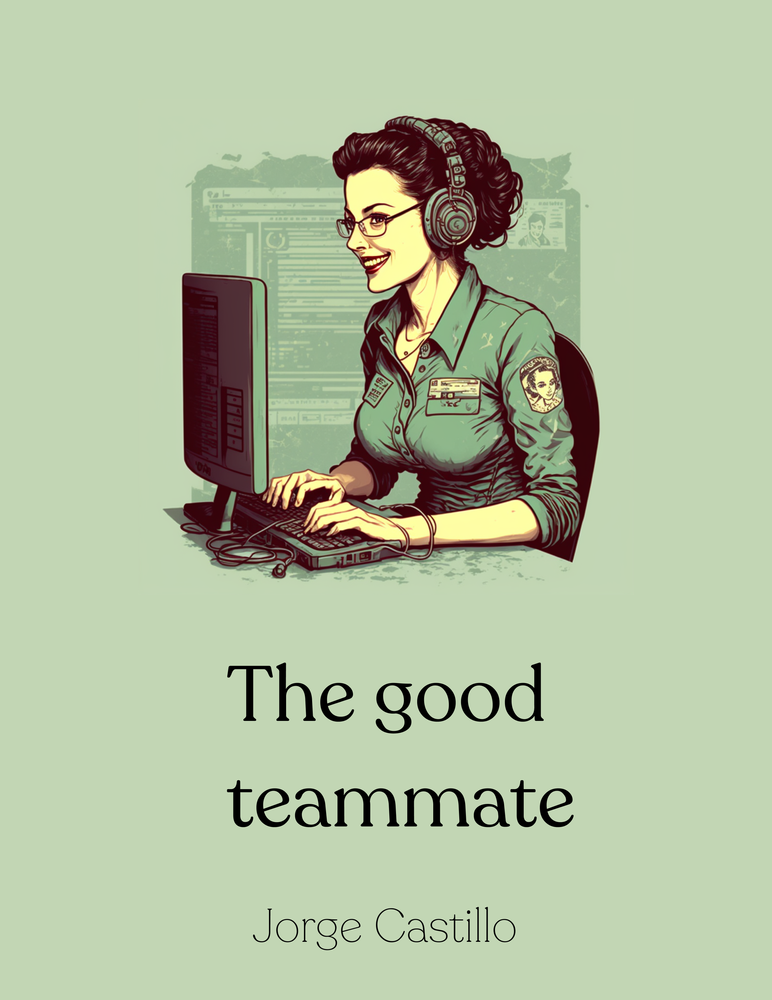
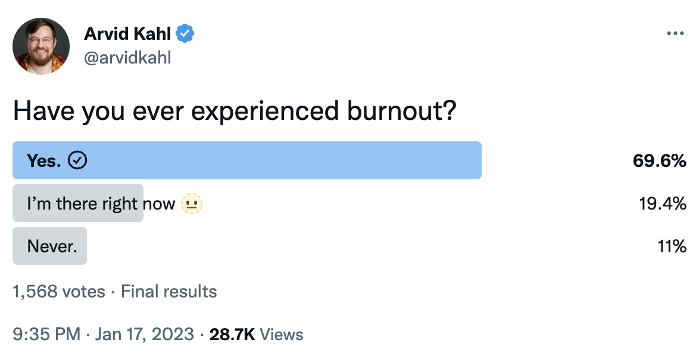
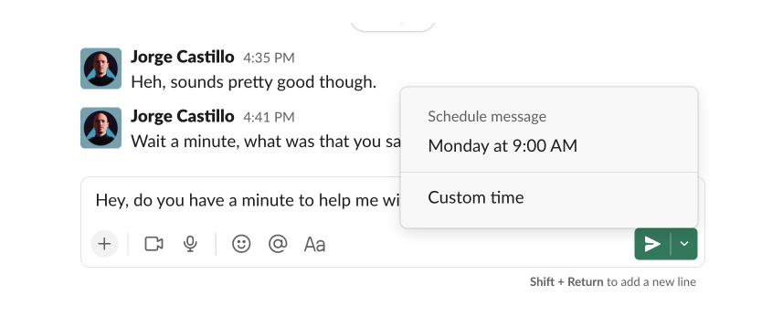
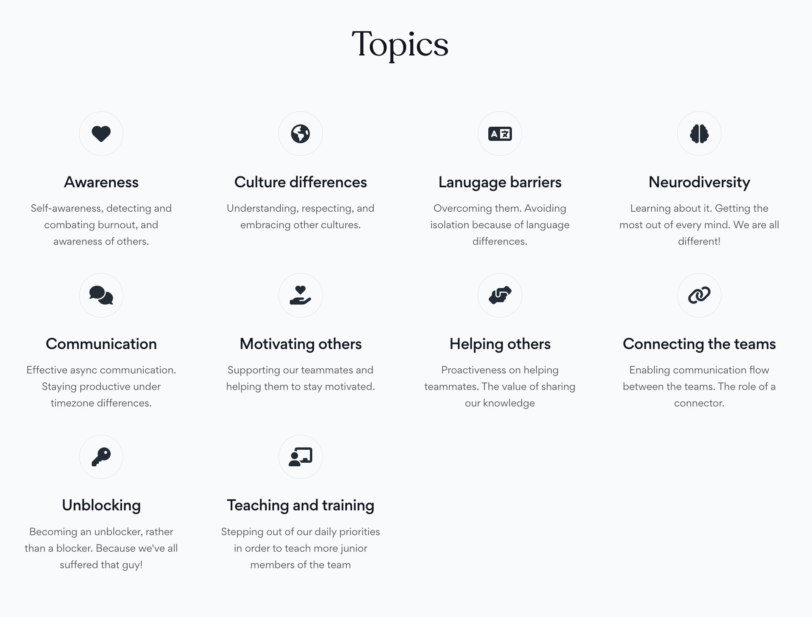

  

    
After 11+ years working as a software engineer in diverse environments and sharing teams with people from different languages and cultures, I realized that my most important learnings are related to soft skills and awareness.

    
This book is my constructive attempt to share those learnings with you ✨

   

      
          
      
      
          
      
      
            
        
      
            
        
      
            
        
      
          
        
    

    

    
<a target="_blank" href="https://leanpub.com/thegoodteammate/">Get the book</a>

    
<a target="_blank" href="https://twitter.com/thegoodteammate/">Follow on Twitter</a>

    
<a href="#preview">Read chapter 1 for FREE 👀</a>

    
<a href="#sponsor">Sponsor the book 👇</a>

  

  

    
  

---

<h2 class="" style="">Awareness, empathy and effectiveness in a diverse tech world</h2>

After 11+ years working as a software engineer in diverse environments and sharing teams with people from different languages and cultures, I realized that my most important learnings are related to soft skills and awareness.

This book is my constructive attempt to share those learnings with you. Because I believe that being aware of and promoting the topics covered in this book can help us to build and maintain a constructive and healthy work environment where every member of the team can shine ✨

---

👀 FREE content - chapter 1 for free

## Chapter 1: Awareness

    

      <h3 className="text-center pb-4">Self-Awareness</h3>

      
One of the biggest problems we suffer in the world of software development is burnout. Not many developers make it explicit, but polls like the following one by Arvid Kahl make it very obvious. In this specific poll, around a 89% of a total of 1500 developers declared that they had experienced burnout or are still experiencing it.

      
      

      
These numbers are particularly shocking, since it is almost every developer out there. And Arvid is quite a creative and motivating person, so one would not think that his audience could be biased towards a pesimistic view of the sector, or anything like that.

      
Personally, I have also suffered burnout in my own flesh, a few times. Especially during stressful times, which is when it is harder to combat. Let me give you some pointers on how to detect and combat it, since self-awareness is probably one of the most important skills to develop as a software developer.

      <h3>The signs of burnout</h3>

      
Burnout is an emotional state. The main synthoms are mental and physical exhaustion, and as a consequence, an absolute lack of motivation and will power. It is frequently caused by prolonged stress and frustration. Here are some of the signs that made me understand my mental condition when I suffered it:

      <h4 className="mt-5 pb-4">Exhaustion</h4>

      
Feeling drained, with a total lack of energy and motivation. When I was given a task to complete, it was hard for me to stay positive and keep a constructive attitude.

      <h4 className="mt-5 pb-4">Emotional detachment</h4>

      
Feeling detached from your job and teammates. Experiencing a gradual loss of interest or pleasure in the work you do. This is actually pretty common, especially when you’ve been working in the same projects for a long time. People loses motivation quickly. This is something companies can keep an eye on, and find ways to rotate people, or projects. Definitely recommended to raise your hand and talk to your manager when you are feeling this way.

      <h4 className="mt-5 pb-4">Cynicism and negativity</h4>

      
Often we feel negative or cynical about our projects, tasks, opin- ions of our teammates, etc. This leads us to become pretty blocker. We’ve all worked with that guy that blocks our pull requests for weeks for the wrong reasons. We can end up denying most new ideas and challenges, since we don’t have the energy to face them.

      <h4 className="mt-5 pb-4">Low performance</h4>

      
Your work throughtput becomes worse gradually. You make more mistakes, take more shortcuts. Overall, you are, and feel less pro- ductive. You start making excuses when you give reports about your progress to your teammates or managers.

      <h4 className="mt-5 pb-4">Physical symptoms</h4>

      
You can experience headaches, insomnia, or fatigue, for example. You can wake up in the middle of the night thinking about your work, fully stressed. Then taking you hours to fall asleep again. Physical symptoms can quickly lead to worse symptoms, so better to keep an eye on them.

      <h4 className="mt-5 pb-4">Difficuly to concentrate</h4>

      
Making decisions becomes especially hard.

      <h4 className="mt-5 pb-4">Lack of accomplishment and feeling of stagnation</h4>

      
Burnout goes hand in hand with fustration. When we don’t feed our motivation, give us space to be creative and play, and never feel rewarded for our work, it is very common to start feeling frustrated.

      
      

      <h3 className="text-center mt-5 pb-4">Combating burnout</h3>

      
It is very important to let you know that I was not able to identify all these symptoms by myself the first time, neither the second. Your mental state makes it particularly hard, actually. This is something you learn gradually, the more you get to know yourself.
Here are some ideas that worked great for me and I learned along the way:

      <h4 className="text-center mt-5 pb-4">Prioritize self-care</h4>

      
You go first than anything else. If you are not happy, it is definitely time to take action and make a difference. Change whatever that is making you feel bad. Acquire healthy habits, exercise, read, spend time on your hobbies, change your job, whatever. Everything is good. And be grateful if you have the chane to do these things! we are privileged.

      <h4 className="text-center mt-5 pb-4">Healthy work-life balance</h4>

      
Keeping a good balance between work and personal / family life is absolutely key. Work is important, but it is by far less important than living, and spending time with the people you care about.

      <h4 className="text-center mt-5 pb-4">Promote a culture of work-life balance</h4>

      
Find the boundaries and be strict about them. Pick a strict work schedule. If you are working for a company, be explicitly strict about it when you talk to your teammates and managers. If they have enough experience in this sector, they’ll understand. Doing this makes you become a role model for others. Not doing it implies putting more pressure on them, since they feel in the need of keeping up with your exaggerated dedication. Never work over hours!

      <h4 className="text-center mt-5 pb-4">Setting realistic and manageable goals
</h4>

      
This is something any athlete will tell you. It is much easier to manage short term goals than too ambitious ones. You can break any ambitious goal into smaller ones, which I absolutely recom- mend. In software, development we feel this often when we are given a very challenging project or task. First thing to do: split it in more manageable chunks. This works for everything in life. That is how I was able to write the Jetpack Compose internals book*, with 200+ pages covering a very complicated topic. Chapter
by chapter, iteration after iteration. Frequent releases, frequent feeling of reward. You must know yourself and be smart about how to trick your brain a bit to achieve your goals.

      <h4 className="text-center mt-5 pb-4">Prioritizing and delegating tasks to minimize stress</h4>

      
This goes in the same line than the one above. Some days I feel less motivated, and I have discovered than tackling the simplest tasks first allows me to get in the mood to start delivering. On top of this, delegation is also important. Sometimes we are fighting a project that is becoming very hard and we feel a need to proof that we’re capable of completing it. That is always a big trap! best thing we could do is ask for help early on and avoid getting blocked. Which leads to a much healthier work environment!

      <h4 className="text-center mt-5 pb-4">Taking regular breaks thoughout the day</h4>

      
Having a routine helps a lot. Taking breaks is part of it. Take them as soon as you start feeling exhausted, you’ll quickly see how it makes a difference. Remote work helps massively with this, since it usually comes hand in hand with working hours flexibility. You can just go out for a walk, do some groceries, whatever, and come back later. Procrastination is very helpful to refresh our mind. We have all gone to bed feeling like garbage after a bad day at work trying to solve a complicated problem, then you wake up next day with a fresh mind and you solve it in 5 minutes. That is no coincidence.

      <h4 className="text-center mt-5 pb-4">Engaging in activities outside of work that bring you joy and relaxation</h4>

      
Hobbies, sports, games, hanging out with your friends, spending time with your partner and kids, anything is good. Do things unrelated to work after work.

      <h4 className="text-center mt-5 pb-4">Seeking help</h4>

      
I absolutely recommend talking to others about what you feel. Let them help you. The only action of making the decision of externalizing and verbalizing your thoughts is already a huge step forward! you instally start feeling better. This is why I can’t recommend enough talking to a psychologist.

      <h4 className="text-center mt-5 pb-4">Self-reflection</h4>

      
Basically what we are doing already with this book! Reflecting on what causes burnout helps you to become more self-aware. Writing this book instantly helped me, since it is literally the same exercise.

      <h4 className="text-center mt-5 pb-4">Encourage and support open communication among team members</h4>

      
I’ll talk more about this is this book, but the more you communi- cate, the less barriers you and your teammates will have to share the pressure, delegate, coordinate, and ultimately work smoothly together. Encourage collaboration and teamwork!
There are no silver bullets to beat burnout, but these things definitely helped me, and will likely be a good start for you to enjoy your job!

      
<a target="_blank" href="https://leanpub.com/thegoodteammate/">Buy The good teammate 💸</a>

      

      <h3 className="text-center pb-4">Awareness of others</h3>

      
Self-awareness is great, but being a good teammate also requires being aware of others. Being conscious about that in a work envi- ronment helps to foster a sense of teamwork and collaboration, improves communication and understanding among colleagues, so it leads to more efficient and effective work. On top of that, it can also help to create a more positive and inclusive work culture, achieving better job satisfaction and motivation across the team.

      
      
Here are some learnings I gathered from my career as a developer.

      <h4 className="text-center mt-5 pb-4">Working hours</h4>

      
Being aware and respectful about others’ working schedule makes things easier for every one. The same way you don’t like to be pinged late in the night, you should refrain you from doing so with others. It needs to be an absolute priority that every member of the team enjoys their time off without caring about work at all. This is another way to help reducing fatigue and potential burnout.

      
Every member of a team has different time constraints and re- sponsibilities that might affect their availability. We must respect everyone, and do our best to give them their space. The best way to do that is to practice and promote awareness.

      
Modern tools usually come along with features to schedule mes- sages, show multiple timezones, see other people’s calendars, and so on. Here is an example of message scheduling in Slack:

      

      
During my latest years as an Android developer I’ve had the chance to work for US based companies from Europe. The timezone difference is important, but can be alleviated drastically when you have good asynchronous communication skills. Twitter is a good example of a place were I learned to be more careful with this.

      
Being concious about these things instantly make us become better teammates. It also raises the level of communication and collabora- tion across the team, and makes team members able to plan their work accordingly while being efficient when doing it. This also includes scheduling meetings. We must be flexible and understand- ing when scheduling any type of mandatory events or establishing deadlines.

      
Work can also be distributed more fairly thanks to this, since you can avoid one person doing the work of others only because she is usually connected in some specific time frame. We also want to avoid last-minute requests that require people to connect out of their working hours.

      
In tech, project normally require lots of coordination and collabo- ration, so having the skill to be smart about when to ping people can be a game changer for productivity.

      <h4 className="text-center mt-5 pb-4">Caregiving responsibilities</h4>

      
Among the diverse constraints and responsibilities that workers might have, there is caregiving. Some people have children or take care of elderly relatives. This can impact their time and energy. We must be empathetic with them at all times, and make it easier for them to take all the time they need for this.

      
On the other hand, other people are on their 20s, full of energy and ambition and without many responsibilities. They would travel the world if needed, in order to chase their goals. We must respect everyone, and do our best to give everyone their space. The best way to do that is to practice and promote awareness.

      
I once had a teammate that was taking care of her grandmother, who was very old. My teammate needed to cook for her, bath her, do the groceries, walk her out to breath some fresh air, spend time with her, etc. Basically all the things we all might need to do when we have to take care of our elders. Imagine the emotional effort this person had to do every single day, and still show up at work. Keep this always in mind, because our industry is still full of young people, but that will not always be that way. We also never know the personal limitations of the people around us. People often might be reserved about those things.

      <h4 className="text-center mt-5 pb-4">Cultural constraints</h4>

      
We must be absolutely respectful of different cultural and societal norms that may affect how a member of the team reacts to differ- ent situations. We normally forget these things because we all live within our own bubble, but I think it is useful to go over some examples of this.

      
Some cultures value group harmony and deference over individual achievement. Other cultures promote competition and individual- ism as one of their key values. Regardless of how much we agree with one or the other, we must embrace diversity and understand that we are all different. An harmonic diversity makes us better people. It also makes us more effective and empathetic when talking to each other.

      
A person from a culture that values indirect communication may have difficulty providing clear and direct feedback, and may rely more heavily on nonverbal clues or indirect language. A person from a culture that values humility may have difficulty advocating for their own ideas or accomplishments in a work setting. In these two cases, we would make their lifes easier if we would approach them individually and in private to ask about those things in a positive and constructive way. Many times it works better to do it in a written way, like chat or email. That makes them feel less conditioned and more open to express their thoughts and share their ideas. Of course this is not only limited to managers, but something we can all contribute to within the team.

      
On the other hand, we might also work with people from cultures with a strong sense of community. Those individuals may have difficulty adapting to a more individualistic work environment where people work in silos and focus on their own tasks, or adapt- ing to people from the groups described in the previous paragraph. People that values socialization and group work normally prefer eye to eye conversations and direct communication.

      
Finding effective ways to make both groups feel equally comfort- able, get all of them to share their ideas, contribute to, and align with the team goals is not an easy task, for sure. That said, it is something we can work on. An interesting action point here can be to open diverse communication channels, so people can find it easy to communicate regardless of their personality and culture. We might think that forcing individualists, introverts, or people from cultures that value indirect communication into an eye to eye meeting would be good for team building, but it actually works exactly the other way around, normally. Instead of forcing people to adapt to others, we can make an effort to understand them and find intermediate points that make everyone comfortable.

      
I’ve met people from all these groups so far in my career, and in my opinion team players and solo players can complement each other really well when they are able to understand that they just think differently. I’ve seen people discuss for hours about a given topic only because their cultures or way to think were very different and they were not able to get to an agreement. At those moments, stepping back and realizing what it is really happening is what actually makes the difference. If you find this situation on your team but you are not involved in the discussion, you can also help. Normally, the figure of a mediator, or simply a third person that comes to give her opinion in a constructive and empathetic way is enough to suffocate the discussion.

      
Getting back to the examples of culture differences, let me share a few more with you, and then make a final point in the end.

      
Sometimes we also work with people that values formality and hierarchy a lot. These people might not feel comfortable with a more informal communication style, which is quite common in many tech companies.

      
There are also persons from a culture where the concept of time is more flexible or subjective, those persons may have a different approach to deadlines and time management. If we don’t under- stand their culture, we might start having a rude or stressful relation with them at work. It also works the other way around: if they are not able to understand the importance of deadlines or delivery for the company, they might start feeling out of place and underproductive compared to their teammates.

      
For these two cases, along with all the ones described earlier in this section, the most effective action point is to set clear norms, guidelines, and boundaries upfront. Setting rules for communication, meetings (start / end times, respectful behavior), deadlines, and other relevant areas lets people have a sense on how to work and perform in a common environment. If we don’t do this, everyone is blind and naturally unempathetic / unaware. Setting boundaries also helps a lot. An example: Let’s say you are a youngster in a lead role, and one of your peers has a culture that values respect for elders. This person might find it hard to work with a team leader who is younger. The way you approach to and communicate with your peer will make a huge difference.

      
These are only a few examples and action points on culture diversity. The more we embrace diversity, the more we learn about other cultures, and the more empathetic we become. We must fight for removing barriers rather than imposing them.

      

      
<a target="_blank" href="https://leanpub.com/thegoodteammate/">Buy The good teammate 💸</a>

      
      <h4 className="text-center mt-5 pb-4">Language constraints</h4>

      
Be sensitive to language barriers. A member of our team whose primary language is not English might have issues for communi- cating effectively, especially about technical concepts that can be very complex.

      
My mother tongue is Spanish, so I have experienced this a few times when working for companies where my teammates were native English speakers.

      
<i>To be fair, it was only a handful of times. I must say that many of my teammates so far were empathetic and aware of this, so they would friendly repeat things as many times needed, or try to speak a bit slower. It’s funny, because I noticed when they were doing this and appreciated it, but did not tell them explicitly. That is something I can improve and I’m sure they would have been happy to know!</i>

      
There are times where people would just speak quickly without caring much. Sometimes we think that we look smarter when we speak quickly about stuff. It’s a bit nonsensical but yeah, it happens. If you find yourself doing this, please don’t. Indeed, effective communication is critical, but speaking quickly does not imply effectiveness. My suggestion here is to think a few times before sending a message or starting a conversation about something technical. In the era of async communication, we can use that in our advantage: type, correct, type again, until the message is clear and straightforward. Practice conciseness and expressiveness, and become a role model on it. This means more quality in communi- cation, less quantity, less spam, and less rambling.

      
If you are a native English speaker, one great exercise you can do when you have non-native english speakers on the team is to realize how much effort they do to speak your language, and the merits of learning to speak it at that level. Imagine yourself discussing technical things in Spanish. I admire anyone that makes an effort to learn other languages, since that removes barriers.

      
Meetings is another field where non-native speakers can have important issues. When every other participant speaks their native language, they will often subconsciously start speaking to each other quickly and very fluently. It is natural that they do so, but it makes contributing to group discussions harder when you speak a different language. Take care of this during meetings.

      
Building relationships is also hard in these cases. Culture and language differences add up, and we can easily make people feel isolated. The best thing you can do is to approach to people from time to time. Have quick chats, have a coffee together, jump on a videocall, whatever works. Something I do a lot is to ask a teammate for hoping on a call at random times to discuss whatever work or non-work related topic. That feels like opening a window, and helps to create bonds that make it much easier for both of you to work together moving forward.

      
Another time when language can become a bit of a barrier is peer reviews. It is sort of a delicate situation, since you normally want to be honest on your review, so you’ll often give good but also bad feedback (things to improve). When you need to write a review for a teammate in another language, it can be challenging to find the right tone to express things. If you are receiving a peer review and you are a native speaker, please have that in mind and not take things personally.

      
In the other hand, English is considered the common language, since it is still the most widely spoken one worldwide (followed by Mandarin, Hindi, and Spanish, in that order. Just to satisfy my own curiosity!). For this reason, and because it is the language we use to communicate and write code in tech companies, it is fair to expect that people who speak other languages make an effort to improve their English proficiency. It obviously takes time, but that is the only way for them (us) to become fluent and remove the language barriers. If English speakers want to learn other languages, that is great and very welcome, but we must also be realistic and reasonable about this.

      

      
<a target="_blank" href="https://leanpub.com/thegoodteammate/">Buy The good teammate 💸</a>

      <h4 className="text-center mt-5 pb-4">Neurodiversity</h4>

      
In human kind, and therefore also within tech companies, there is a natural diversity of human minds. Just like there is a natural diversity of bodies and physical abilities. We can find multiple neurological conditions in our teammates at work, closer than what we think. It actually fairly common. However not all the cases are made public.

      
Some examples of neurodiversity can be any of the multiple de- grees of autism, dyslexia, or ADHD. These are variations of the human brain, and we must respect them as such. A problem we currently have in modern societies regarding this, is that science knows almost nothing about neurodiversity. That leads us to treat people with those conditions as different (and many times “worse”) than what we understand as “normal”. We must run away from using terms like “disabled” or “disordered”.

      
Trying to fit everyone into a narrow, one-size-fits-all model of “normal” or “standard” behavior is a huge mistake, because we are diverse.

      
      
I got a few cases within my own family, and you would be surprised of how many interesting abilities they can develop if they are given the chance to shine. We could actually foster those abilities. What if we all picked to think of these as mental abilities instead?

      
Different levels of physical and mental abilities may impact peo- ple’s ability to complete tasks, pay attention, or organize their work among other things. A very good example of this is ADHD (Attention-Deficit / Hyperactivity Disorder). In a tech company, where tasks are often complex, require attention to detail, ability to focus for long periods, and adapt to changes all the time, people with this type of abilities may find some difficulties. It is our job to make them feel comfortable and help them to boost their full potential.

      
We should do an exercise of self-reflection and realize that we all are different. We live in this world together, and we all share work spaces. Empowering neurodivergent people we are also empower- ing different ways of thinking, learning, and communicating.

      <h4 className="text-center mt-5 pb-4">Stay open to feedback</h4>

      
No one is fully aware of everything, we learn new things every day. For that reason, it is key to stay open to feedback in order to improve. We must be willing to adjust our approach to better support and accommodate the needs of those that work with us.

    

  

<a target="_blank" href="https://leanpub.com/thegoodteammate/">Buy The good teammate 💸</a>

---

---

<!-- ### Companies supporting the book -->

<!--

  

-->

<!--Build **real-time chat in less time** with Stream’s API & SDK solutions. [Activate your free Stream Chat trial](https://getstream.io/chat/trial/?utm_source=JetpackComposeInternals&utm_medium=Webpage_Content_Ad&utm_content=Developer&utm_campaign=JetpackComposeInternals_June2022_ChatTrial) to start building today.-->

<!-- > Stream is our current silver 🥈 sponsor. Thanks to their support the book price is ⏬  **cut by a 25%** ⏬ until the beginning of July. This effectively makes it more accessible to devs from around the world. Find them in [getstream.io](https://getstream.io/).-->

## Sponsoring the book

Any company can become a sponsor. There are different sponsorship levels, but all of them will make the company appear in the book attributions page and in any existing book sites like [Leanpub](https://leanpub.com/thegoodteammate/) and this page you are reading now. *The company will provide a paragraph that will be advertised along with the company name and logo*.

Any sponsorships will have a frequent prominent position on any relevant updates about the book shared in social media.

### Sponsorship levels

  

    
<b>Diamond</b> 💎

    
A Diamond sponsor makes the book <b>completely free</b> for a month, so it becomes effectively accessible to every developer in the world. A Diamond sponsor has total exclusivity, if there is a diamond sponsor, no more sponsors will be accepted.

    
<b>Platinum</b> ✨

    
Platinum sponsors reduce the book price a 75% during a month. If there is more than one platinum sponsor, the book becomes completely free.

    
<b>Gold</b> 🥇

    
Gold sponsors reduce the book price a 50% during a month. If there are three or more gold sponsors, the book becomes completely free.

    
<b>Silver</b> 🥈

    
Silver sponsors reduce the book price a 25% during a month. If there are 4 silver sponsors or more, the book becomes completely free.

    
<b>Copper</b> 🥉

    
Copper sponsors reduce the book price a 10% during a month.

  

## The book content

> The book covers following topics among many others.

  

    <b>Awareness</b>
    

      Self-awareness, detecting and combating burnout, and awareness of others.
    

  

  

    <b>Culture differences</b>
    

      Understanding, respecting, and embracing other cultures.
    

  

  

    <b>Language barriers</b>
    

      Overcoming them. Avoiding isolation because of language differences.
    

  

  

    <b>Neurodiversity</b>
    

      Learning about it. Getting the most out of every mind. We are all different!
    

  

  

    <b>Communication</b>
    

      Effective async communication. Staying productive under timezone differences.
    

  

  

    <b>Motivating others</b>
    

      Supporting our teammates and helping them to stay motivated.
    

  

  

    <b>Helping others</b>
    

      Proactiveness on helping teammates. The value of sharing our knowledge
    

  

  

    <b>Connecting the teams</b>
    

      Enabling communication flow between the teams. The role of a connector.
    

  

  

    <b>Unblocking</b>
    

      Becoming an unblocker, rather than a blocker. Because we've all suffered that guy!
    

  

  

    <b>Teaching and training</b>
    

      Stepping out of our daily priorities in order to teach more junior members of the team
    

  

---

### Support me by buying the book

By buying the book you are not only rewarding the countless hours of effort invested, but also boosting my motivation to keep working on it 🙏

<a target="_blank" href="https://leanpub.com/thegoodteammate/">Get the book</a>

<a target="_blank" href="https://twitter.com/thegoodteammate/">Follow on Twitter</a>

<a href="#preview">Read chapter 1 for FREE 👀👆</a>

<a href="#sponsor">Sponsor the book 👆</a>

